## [Volver atrás](/readme.md)

<div align="center">
<h1>TP 1. Herramientas de Diagnóstico de Redes</h1>
</div>

**Objetivo**: Conocer el funcionamiento y familiarizarse con las herramientas que permiten explorar, diagnosticar problemas y medir diferentes aspectos de una red. Categorías ISO: FCAPS.

Tanto en este práctico como en los sucesivos, es sumamente conveniente que realicen una transcripción de lo escrito y obtenido por pantalla. Para ello, antes de iniciar la práctica, ejecute el comando **script guardado_de_salida_fecha.txt**. Al finalizar los ejercicios, escriba el comando **exit** para cerrar y guardar el archivo. Toda la documentación de los comandos que se utilizarán se puede obtener con **man comando**.

## Bibliografía

- OPPENHEIMER, P., 2011, Top-Down Network Design (3d ed). CISCO Press.
    - Capítulo 2. Sección “Network Performance” (pp. 32-44)
    - Capítulo 3. Sección “Checking the Health of the Existing Internetwork” (pp. 71-81)

## Trabajo Práctico

### ping (RTT)

1. Instale y configure la herramienta [SmokePing](http://smokeping.org/). Mida durante al menos dos horas contra 3 hosts localizados en distintos continentes (puede emplear aquellos de la consigna previa). Adjunte los gráficos correspondientes a las mediciones realizadas y comente los comportamientos que puede observar a partir de ellos. Encontrará una breve [guía de configuración de la herramienta](http://www.labredes.unlu.edu.ar/sites/www.labredes.unlu.edu.ar/files/site/data/aygr/smokeping.pdf) adjunta a esta práctica.

    <div align="center">

    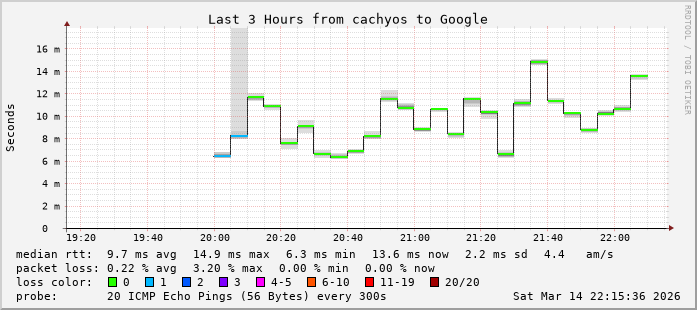

    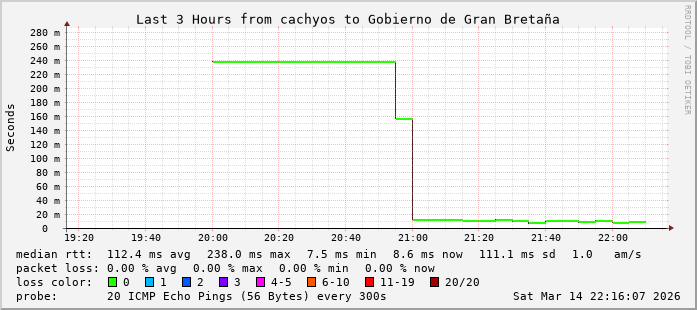

    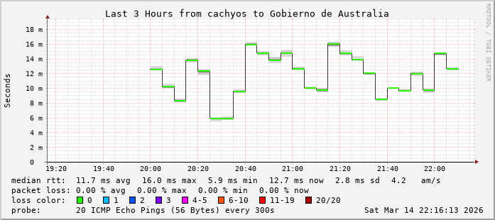

    </div>

2. ¿Qué comportamiento se observa? ¿Qué implicaría un incremento/disminución de la latencia a partir de un patrón establecido? ¿Qué otras utilidades ofrece esta herramienta?

    El comportamiento observado muestra que las latencias de los hosts medidos son bajas. En el caso de ***www.gov.uk*** hubo un período de tiempo entre las 20 hs hasta aproximadamente las 21 hs en el cual la página no estaba disponible, pero como se puede observar en el gráfico, tiene una latencia estable, rondando los 20 ms. En el caso de ***www.google.com*** y de ***my.gov.au***, ambas también presentan latencias bajas con fluctuaciones pequeñas. No se observan pérdidas de paquetes, excepto en el caso de ***www.google.com*** al inicio de la medición, aún así la cantidad es insignificante. 
    
    Un incremento de la latencia respecto a un patrón indicaría la congestión de la red (sea debido a un enlace intermedio o ataques DDoS, entre otros) o debido a la degradación de hardware. Un decremento de la latencia respecto a un patrón ocurriría por lo contrario a lo mencionado anteriormente: hubo mejoras en el ruteo o una reducción en la carga de la red. 

    Otras utilidades que brinda Smokeping son la detección de pérdida de paquetes, el monitoreo de la red mediante múltiples protocolos como HTTP, DNS, SSH, entre otros; y poder realizar registros de la red a largo plazo, en tiempos de semanas o meses.

3. ¿De qué manera afecta la latencia a las aplicaciones? Describa y brinde ejemplos.

    La latencia puede afectar de varias maneras a las aplicaciones según el tiempo de respuesta que necesiten. 
    
    Las aplicaciones de tiempo real necesitan que los datos lleguen lo más rápido posible, por lo tanto se ven gravemente afectadas por latencias grandes. Por ejemplo, en el caso de videollamadas, mientras más alta sea la latencia, más retraso va a haber en la comunicación, o en el caso de los videojuegos, un ping alto significa que lo que haga el jugador va a tardar en llegar al servidor, por lo que puede volverse injugable.

    Las aplicaciones interactivas no se ven tan afectadas por esto, en la mayoría de los casos sólo se ven afectados los usuarios, ya que deben esperar más tiempo cuando envian o reciben inputs o solicitudes. Un ejemplo de esto es cuando se accede de manera remota a una computadora, el ingreso de caracteres tarda en verse reflejado en la pantalla debido a la latencia alta.

    Las aplicaciones de transferencia masiva son afectadas mínimamente ya que mueven grandes cantidades de datos a la vez, por ejemplo cuando se descargan archivos grandes o se realizan backups remotos, lo que realmente importa es el ancho de banda una vez establecida la conexión, y no la latencia.

4. Configure Smokeping para que además de medir latencia contra los destinos consignados, mida el uptime de tres servicios web: un portal de noticias, una app web y una API REST pública. Adjunte la configuración utilizada.

    ```
    *** Probes ***
    + Curl
    binary = /usr/bin/curl
    step = 60
    pings = 5
    urlformat = https://%host%/

    *** Targets ***
    + Web
    menu  = Servicios Web
    title = Monitorización de Servicios Web
    probe = Curl

    ++ Infobae
    menu  = Infobae
    title = Portal de Noticias - Infobae
    host  = www.infobae.com

    ++ Notion
    menu  = Notion
    title = App Web - Notion
    host  = www.notion.so

    ++ CatAPI
    menu  = Cat API
    title = API REST - Cat as a Service
    host  = cataas.com
    urlformat = https://%host%/cat
    ```

<div align="center">

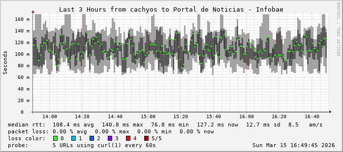

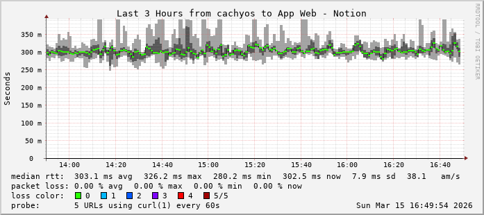

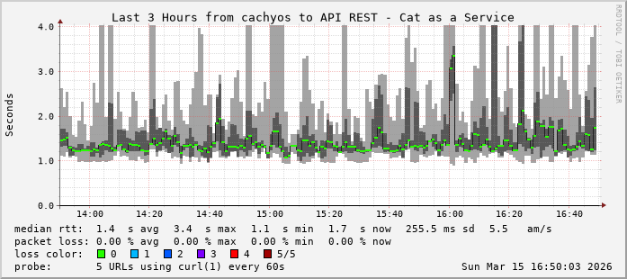

</div>

5. Conceptualmente, ¿qué diferencias principales hay entre medir latencia contra un destino mediante ICMP y medir latencia mediante protocolo HTTP/S?

    Medir la latencia mediante ICMP significa medir a nivel de la capa de red, se envía un Echo Request y se espera el Echo Reply, midiendo el RTT (Round Trip Time), es decir el tiempo de ida y vuelta. 

    Medir la latencia mediante HTTP/S significa medir a nivel de la capa de aplicación, el RTT mide tanto el tiempo de red como el tiempo que tarda el servidor en procesar la solicitud y generar una respuesta.

### traceroute

1. Verifique la ruta que podría llegar a seguir un paquete IP hacia el host **8.8.8.8** (servidor DNS público de Google). Ejecute la misma consulta varias veces y en momentos distintos ¿Qué conclusión puede obtener?

    ```
    ❯ traceroute 8.8.8.8
    traceroute to 8.8.8.8 (8.8.8.8), 30 hops max, 60 byte packets
    1  _gateway (192.168.100.1)  0.307 ms  0.444 ms  0.319 ms
    2  host102.181-89-6.telecom.net.ar (181.89.6.102)  11.409 ms  5.186 ms  5.230 ms
    3  * * *
    4  * * *
    5  host234.181-96-113.telecom.net.ar (181.96.113.234)  10.725 ms  17.031 ms  17.069 ms
    6  72.14.194.198 (72.14.194.198)  10.838 ms  16.277 ms  15.942 ms
    7  192.178.73.87 (192.178.73.87)  11.572 ms 192.178.80.111 (192.178.80.111)  13.906 ms 192.178.73.87 (192.178.73.87)  17.792 ms
    8  142.251.239.159 (142.251.239.159)  14.262 ms 209.85.250.153 (209.85.250.153)  6.997 ms  7.038 ms
    9  dns.google (8.8.8.8)  10.982 ms  11.343 ms  11.502 ms

    ❯ traceroute 8.8.8.8
    traceroute to 8.8.8.8 (8.8.8.8), 30 hops max, 60 byte packets
    1  _gateway (192.168.100.1)  0.415 ms  0.535 ms  0.412 ms
    2  host102.181-89-6.telecom.net.ar (181.89.6.102)  5.054 ms  5.180 ms  11.633 ms
    3  * * *
    4  * * *
    5  host234.181-96-113.telecom.net.ar (181.96.113.234)  17.596 ms  16.791 ms  17.632 ms
    6  72.14.194.198 (72.14.194.198)  11.421 ms  16.250 ms  16.371 ms
    7  192.178.80.111 (192.178.80.111)  7.221 ms 108.170.255.31 (108.170.255.31)  11.256 ms 192.178.80.111 (192.178.80.111)  13.885 ms
    8  142.251.239.149 (142.251.239.149)  17.810 ms 142.251.239.147 (142.251.239.147)  11.114 ms 142.251.77.171 (142.251.77.171)  10.525 ms
    9  dns.google (8.8.8.8)  14.595 ms  10.817 ms  11.279 ms

    ❯ traceroute 8.8.8.8
    traceroute to 8.8.8.8 (8.8.8.8), 30 hops max, 60 byte packets
    1  _gateway (192.168.100.1)  0.436 ms  0.562 ms  0.347 ms
    2  host102.181-89-6.telecom.net.ar (181.89.6.102)  4.963 ms  5.086 ms  11.790 ms
    3  * * *
    4  * * *
    5  host234.181-96-113.telecom.net.ar (181.96.113.234)  16.815 ms  11.261 ms  17.633 ms
    6  72.14.194.198 (72.14.194.198)  16.844 ms  11.199 ms  9.834 ms
    7  108.170.255.29 (108.170.255.29)  13.963 ms 192.178.80.111 (192.178.80.111)  14.115 ms  7.447 ms
    8  142.251.239.159 (142.251.239.159)  8.134 ms  14.393 ms 142.251.239.193 (142.251.239.193)  8.163 ms
    9  dns.google (8.8.8.8)  18.220 ms  8.839 ms  11.121 ms
    ```

    La ruta por la que son enviados los paquetes ICMP pueden variar entre las diferentes ejecuciones, ya que Internet utiliza ruteo dinámico. Por lo tanto, los routers eligen por dónde enviar el paquete dependiendo de la congestión de la red y la tabla de ruteo.

2. En qué situaciones puede llegar a ser útil esta herramienta. Ejemplifique.

    Puede ser útil para poder saber por dónde hay una falla en la conexión, ya que muestra hasta que salto llegan los paquetes. Por ejemplo, si hay una página que no me carga, hago un traceroute y me muestra que los paquetes llegan hasta el router de mi ISP, entonces quiere decir que el problema es del ISP.

    También puede ser útil para saber por dónde aumenta la latencia. Por ejemplo, si los primeros 5 saltos tienen latencia baja pero en el siguiente salto aumenta la latencia en grandes cantidades, el problema está en ese enlace.

3. En una red externa a la Universidad, realice **traceroute** al sitio web **www.unlu.edu.ar** y otro a **www.ut.ee**. Indique el ISP que provee el servicio de conectividad a Internet en ese momento. Adjunte la salida del traceroute. En clase, compare su salida contra el de sus compañeros. ¿Hay dispositivos (hosts o direcciones IP) en común entre las salidas de sus pares? ¿Cuáles son?

    ```
    ❯ traceroute www.unlu.edu.ar
    traceroute www.ut.ee
    traceroute to www.unlu.edu.ar (190.104.80.1), 30 hops max, 60 byte packets
    1  _gateway (192.168.100.1)  0.465 ms  0.597 ms  0.380 ms
    2  host102.181-89-6.telecom.net.ar (181.89.6.102)  5.240 ms  5.176 ms  11.621 ms
    3  * * *
    4  * * *
    5  host234.181-96-113.telecom.net.ar (181.96.113.234)  11.142 ms  17.831 ms  10.061 ms
    6  45.68.8.180 (45.68.8.180)  13.869 ms  14.765 ms  7.058 ms
    7  206.188.110.200.unlu.edu.ar (200.110.188.206)  13.384 ms  13.511 ms  6.930 ms

    traceroute to www.ut.ee (141.101.90.16), 30 hops max, 60 byte packets
    1  _gateway (192.168.100.1)  0.502 ms  0.432 ms  0.583 ms
    2  host102.181-89-6.telecom.net.ar (181.89.6.102)  5.151 ms  5.089 ms  5.259 ms
    3  * * *
    4  * * *
    5  host234.181-96-113.telecom.net.ar (181.96.113.234)  10.435 ms  10.795 ms  11.407 ms
    ```

    El ISP que provee el servicio a conectividad en ese momento es Telecom. Esto se puede observar en el segundo host de ambas mediciones, donde se puede ver un puntero reverso que incluye el nombre de Telecom.

### nmap (exploración de la red)

1. Lea el manual de la herramienta y ejecute el ejercicio 1 de la experiencia de laboratorio contra **localhost**. Comente que información adicional visualiza respecto al ejercicio anterior. Compárelo con la ejecución del ejemplo 1 al dominio de la UNLu, y comente brevemente por qué una mala configuración puede representar un riesgo de seguridad.
2. Una de las ventajas de nmap es que permite, mediante comodines o con formato CIDR, hacer un escaneo completo de un segmento de red para descubrir dispositivos presentes en la misma. Busque en el manual la sección “TARGET SPECIFICATION” (o bien en español: ESPECIFICACIÓN DE OBJETIVOS) y deduzca como puede encontrar todos los dispositivos conectados a su red. Puede ver su dirección IP actual mediante el comando **ip addr show**.

    ```
    ❯ nmap -sn 192.168.100.21/24
    Starting Nmap 7.98 ( https://nmap.org ) at 2026-03-16 14:11 -0300
    Nmap scan report for 192.168.100.1
    Host is up (0.00037s latency).
    Nmap scan report for 192.168.100.3
    Host is up (0.084s latency).
    Nmap scan report for 192.168.100.5
    Host is up (0.048s latency).
    Nmap scan report for 192.168.100.7
    Host is up (0.0022s latency).
    Nmap scan report for 192.168.100.8
    Host is up (0.0026s latency).
    Nmap scan report for cachyos3.local (192.168.100.21)
    Host is up (0.00070s latency).
    Nmap done: 256 IP addresses (6 hosts up) scanned in 10.93 seconds
    ```

    A partir de la dirección IP que obtengo mediante el comando **ip addr show**, la cual es 192.168.100.21/24, utilizo el comando **nmap -sn 192.168.100.21/24**. El argumento -sn indica a nmap que no escanee puertos, haciendo que el escaneo sea más rápido.

3. Investigue que opción permite hacer escaneo de puertos UDP y luego utilícela contra un host particular. ¿Por qué podría resultar útil realizar un análisis de ésta característica, si la mayoría de los servicios de red utilizan TCP?

    La opción que permite realizar un escaneo de puertos UDP es -sU. Se utiliza de la siguiente manera:

    ```nmap -sU 192.168.100.1```

    Esta característica es útil para escanear aquellos servicios UDP que podrían estar expuestos, ya que si bien la mayoría de los servicios utilizan TCP, hay otros servicios importantes como DNS, SNMP o DHCP que utilizan el protocolo UDP.

    ```
    ❯ sudo nmap -sU 192.168.100.1
    Starting Nmap 7.98 ( https://nmap.org ) at 2026-03-16 14:34 -0300
    Nmap scan report for 192.168.100.1
    Host is up (0.00044s latency).
    Not shown: 957 closed udp ports (port-unreach), 42 open|filtered udp ports (no-response)
    PORT   STATE SERVICE
    53/udp open  domain
    MAC Address: 70:8C:B6:A8:36:75 (Huawei Technologies)

    Nmap done: 1 IP address (1 host up) scanned in 1037.90 seconds
    ```


4. Instale en un equipo de su hogar la aplicación **nmap** y realice un escaneo a toda la red de su hogar. ¿Que ha logrado descubrir? ¿Existen otros host aparte de su equipo? ¿Qué puertos poseen en escucha? ¿se corresponden con los servicios que usted esperaba?

    ```
    ❯ nmap 192.168.100.21/24
    Starting Nmap 7.98 ( https://nmap.org ) at 2026-03-16 14:25 -0300
    Nmap scan report for 192.168.100.1
    Host is up (0.0062s latency).
    Not shown: 995 closed tcp ports (conn-refused)
    PORT   STATE    SERVICE
    21/tcp filtered ftp
    22/tcp filtered ssh
    23/tcp filtered telnet
    53/tcp open     domain
    80/tcp open     http

    Nmap scan report for 192.168.100.7
    Host is up (0.0029s latency).
    All 1000 scanned ports on 192.168.100.7 are in ignored states.
    Not shown: 1000 closed tcp ports (conn-refused)

    Nmap scan report for 192.168.100.8
    Host is up (0.0027s latency).
    All 1000 scanned ports on 192.168.100.8 are in ignored states.
    Not shown: 1000 closed tcp ports (conn-refused)

    Nmap scan report for cachyos3.local (192.168.100.21)
    Host is up (0.000016s latency).
    Not shown: 999 closed tcp ports (conn-refused)
    PORT   STATE SERVICE
    80/tcp open  http

    Nmap done: 256 IP addresses (4 hosts up) scanned in 30.56 seconds
    ```

    El host con dirección IP 192.168.100.1 tiene los 53 (DNS) y 80 (HTTP) abiertos, mientras que los puertos 21 (FTP), 22 (SSH), y 23 (Telnet) parecen filtrados, posiblemente por un firewall. Esto tiene sentido ya que esta dirección pertenece al router por el cuál accedo a Internet. Los dos hosts siguientes son dispositivos externos, cuyos puertos parecen cerrados, y el último host es mi computadora, con el puerto 80 abierto, lo cual tiene sentido ya que para el ejercicio de Smokeping tuve que usar el servidor Apache.

### iperf (throughput)

1. En el caso de TCP: Realice mediciones empleando diversos tamaños de ventana. Considerando valores: 1kb, 2kb, 16kb, 128kb, 320kb, 10mb. Confeccione una gráfica que represente el throughput respecto del tamaño de ventana efectivamente asignado por el programa.

    <div align="center">

    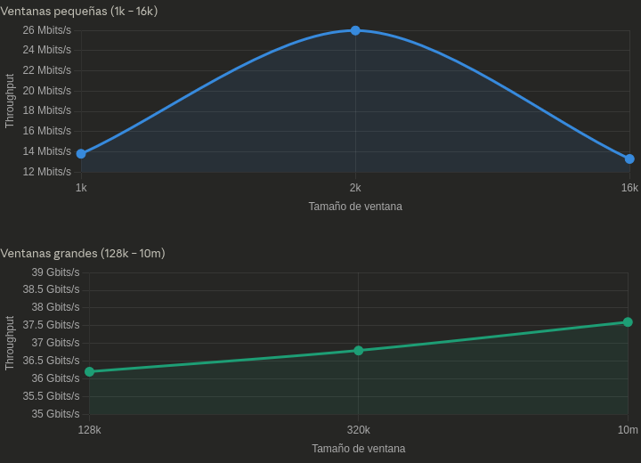

    </div>

    Los valores de throughput para 1kb, 2kb y 16kb de ventana oscilan entre 13 y 26 Mbits/sec debido a que como la prueba se realizó en la misma computadora, el sistema operativo ignora estos tamaños de ventana y los ajusta automáticamente.

2. ¿Qué permite establecer la opción **-M**? ¿Cómo afecta esto al throughput? Investigue la técnica “Path MTU discovery”.

    El argumento **-M** permite establecer el MSS (Maximum Segment Size), el tamaño máximo de datos que contiene un segmento TCP. 

    Mientras más pequeño sea el MSS, en mayor cantidad de segmentos se van a dividir los datos, generando un mayor overhead de headers TCP/IP y reduciendo el throughput ya que se debe procesar cada segmento. Si el MSS es muy grande, superando el MTU del enlace, los paquetes se fragmentan y también afectaría el throughput.

    **Path MTU Discovery** es una técnica que permite determinar cuál es el MTU (Maximum Transmission Unit) más grande en una ruta entre dos hosts. El emisor envía paquetes con el bit "don't fragment", y si algún router tiene un MTU menor, descarta el paquete y devuelve un mensaje ICMP "fragmentation needed" junto con el MTU más grande que soporta. El emisor, luego de recibir este mensaje, reduce su MSS y vuelve a intentarlo hasta encontrar el MTU adecuado. El MTU que se utiliza generalmente en Ethernet es 1500 bytes.

3. ¿Qué efecto presenta la opción **-N**? ¿Qué tipo de aplicaciones pueden requerir tal utilidad?

    El argumento -N desactiva el algoritmo de Nagle en TCP. Lo que hace este algoritmo es acumular los datos pequeños y los envía juntos en un segmento en vez de enviarlos individualmente. Desactivar el algoritmo puede afectar el throughput en transferencias con muchos mensajes pequeños que se envían constantemente.

    Las aplicaciones que requieren esta opción generalmente son las aplicaciones de tiempo real, ya que se necesita que se envíen datos inmediatamente. También puede ser requerida en las aplicaciones interactivas, como en conexiones remotas, si no se usa esta opción entonces puede haber delays al presionar teclas.

### iptraf (estadísticas de uso de la red)

[iptraf](http://iptraf.seul.org/1.4/manual.html#intro) es una herramienta para monitorizar redes IP. Intercepta los paquetes que cursan la red y presenta varias estadísticas acerca del tráfico actual en ella.

1. Inicie la utilidad mediante el comando **iptraf-ng** (como usuario **root**).

2. Consulte las opciones “IP Traffic Monitor”, “Detailed Interface Statistics” y visite el sitio web de la UNLu y otros sitios. ¿Qué información proporciona cada opción?

    <div align="center">

    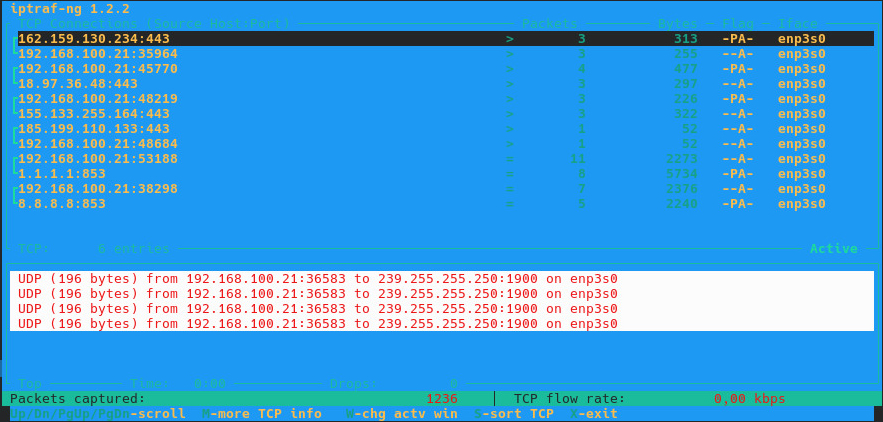

    </div>

    La opción **IP Traffic Monitor** muestra las conexiones TCP que se realizan en tiempo real, la cantidad de paquetes y bytes que intercambian, la interfaz de red que se utiliza para la conexión, y los flags TCP que se utilizan en la conexión (P = PSH, A = ACK). En el apartado que se observa en la parte inferior de la imagen, se muestra el intercambio de datos mediante el protocolo UDP, con destino a 239.255.255.250:1900, la cual es una dirección multicast que se usa para descubrir dispositivos dentro de la red local.

    <div align="center">

    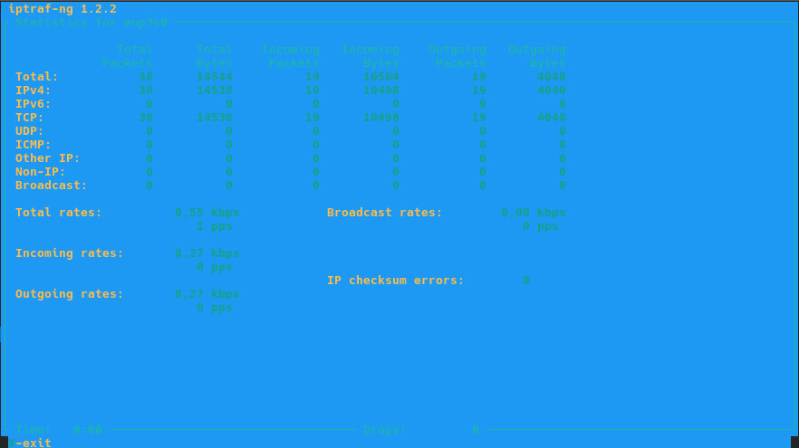

    </div>

    La opción **Detailed Interface Statistics** muestra estadísticas sobre las conexiones que se realizan mediante una interfaz de red. Se puede observar para cada protocolo (y en total) el total de paquetes y bytes intercambiados, y la cantidad de paquetes y bytes recibidos y enviados. También muestra la tasa de transferencia total, la tasa de transferencia para los datos recibidos y enviados, la tasa de broadcast, y la cantidad de errores de checksum en IP.

### ntop (estadísticas de uso de la red)

Herramienta para el monitoreo y análisis de tráfico en la red. Provee una interfaz web para los reportes muy completa e intuitiva.

1. Instale **ntop** en su distribución o mediante docker siguiendo las [instrucciones de instalación](https://www.ntop.org/support/documentation/software-installation/). El servicio levanta automaticamente, si no lo hace Iniciar ntop en su forma básica: como root o con sudo: **ntop -i <interfaz de red>**

    Para mi distribución tuve que utilizar **ntopng**, una vez instalado tuve que iniciar los servicios **valkey** y **ntop** con los siguientes comandos:

        sudo systemctl enable valkey
        sudo systemctl start valkey
        sudo systemctl enable ntopng@enp3s0
        sudo systemctl start ntopng@enp3s0

2. Luego ingrese vía web browser a http://localhost:3000. Debería estar visualizando la interfaz de ntop.
3. Revise las pestañas "Flows", "Hosts". Comente muy brevemente las opciones que le resulten mas útiles o interesantes. Si visualiza poca información, navegue por un par de sitios externos y vuelva a recargar la pagina de Ntop (F5).

    La sección **Flows** muestra los flujos de tráfico en tiempo real, el protocolo que utilizan, la duración del flujo, el throughput actual, y los bytes totales que se transfieren en cada flujo. La sección **Hosts** muestra los hosts con los que interactúa la interfaz de red, y que porcentaje del tráfico fue enviado y recibido por cada host. También muestra el throughput y la cantidad total de bytes transferido contra cada host.

4. ¿Por qué cree que Ntop debe ejecutarse con permisos de root?

    Para poder capturar el tráfico de red a nivel de paquetes se necesita tener acceso a las interfaces en modo promiscuo, y para esto se necesita tener permisos de root. En modo promiscuo, la interfaz de red captura todos los paquetes que recibe, incluso aunque no estén destinados a él. Sin este modo, el sistema operativo filtraría éstos últimos. Además, si no requiriese permisos de root, cualquier usuario de la red podría ver el tráfico sin restricción alguna, lo cual podría ser un riesgo de seguridad.

5. Tras algunos minutos de captura, obtenga los siguientes informes. Indique cómo los obtuvo y qué información relevante puede usted derivar de ellos:
    
    1. ¿Qué hosts en su red son los que más intercambian datos?

        Para saber cuáles son los hosts que más intercambian datos, filtro por total de bytes transferidos de manera descendente. El primer host que aparece es 192.168.100.21, lo cual tiene sentido ya que es la IP de mi equipo, y la mayoría de los datos intercambiados fueron recibidos. En segunda posición se encuentra el host 181.30.211.14, con el que hubo un intercambio de datos de ~20 MB, siendo la mayoría de esos datos enviados por el host. En tercer lugar está el host 142.251.129.46 con unos ~4 MB intercambiados, siendo el 80% de ellos enviados por el host.

    2. ¿Qué protocolos de aplicación son los que más tasa de transferencia entrante o saliente cursan?

        En las conexiones TCP, todas utilizan el procolo TLS, mientras que en las conexiones UDP la mayoría utiliza el protocolo QUIC.

        <div align="center">

        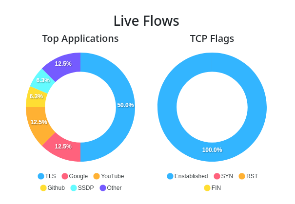

        </div>

        Esta gráfica se obtuvo de la sección Interface -> Details -> Applications

    3. ¿Qué destinos son los más contactados?

        Los destinos más contactados son 192.168.100.21 (nuevamente la IP del equipo), el host 198.41.30.195, 8.8.8.8 (DNS de Google) y 1.1.1.1 (DNS de CloudFlare).

        Esto se puede encontrar en la sección Hosts, filtrando por cantidad de flows de forma descentente.

    4. ¿Qué puertos origen y destino son los más utilizados?

        El puerto de destino más utilizado es el 443, el puerto bien conocido para HTTPS. Mientras que el puerto de origen no se repite ya que, al ser mi equipo el que inicia las solicitudes, utiliza puertos efímeros, (asignados por el sistema operativo) por cada conexión que inicia.

    5. Si el administrador necesita revisar la actividad de la red por periodo de tiempo, ¿cuál listado de ntop ofrece una mejor visualización al respecto?

        Para poder revisar la actividad de la red por período de tiempo, el listado más adecuado sería el que se encuentra en Interface -> Details -> Historical Data. En esa sección se presenta una gráfica que muestra la actividad de la red, y puede seleccionarse si se quiere ver la actividad de los últimos 10/30 minutos, de las últimas 1/2/6/12 horas, o de los últimos días/semanas/meses/año.

        <div align="center">

        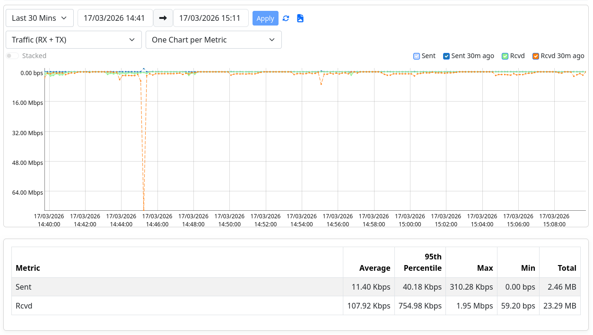

        </div>

    6. ¿Cómo se pueden establecer alertas mediante Ntop?

        En la sección Alerts -> Notifications, se pueden establecer alertas.

        <div align="center">

        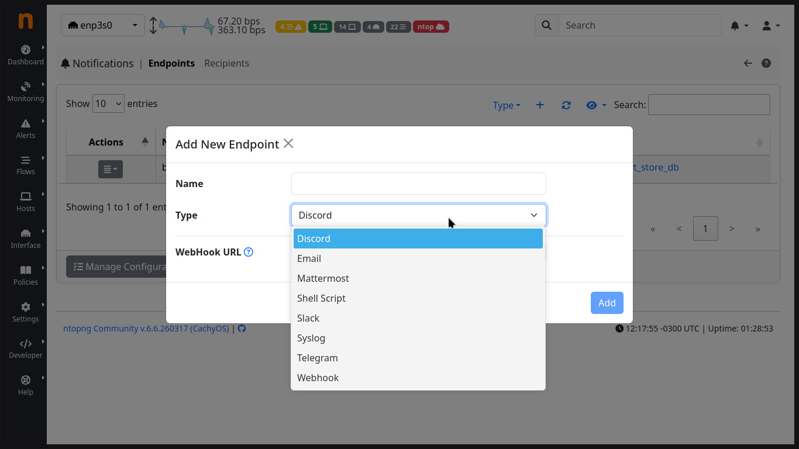

        </div>

        Con el botón + se pueden agregar nuevos endpoints, como email, Slack, etc.

    7. Si necesita ver con ntop un resumen del trafico de los protocolos de la Capa de Aplicación del stack TCP/IP, ¿a que opción debería dirigirse?

        En la sección Interface -> Details -> Applications se puede ver un resumen del tráfico de los protocolos de la Capa de Aplicación en TCP/IP. Muestra el total de paquetes intercambiados, la cantidad total de bytes intercambiados, la cantidad de bytes enviados y recibidos, y el porcentaje relativo de datos intercambiados. También muestra una característica denominada Breed, una clasificación establecida por ntopng que determina cada aplicación por su naturaleza.

        <div align="center">

        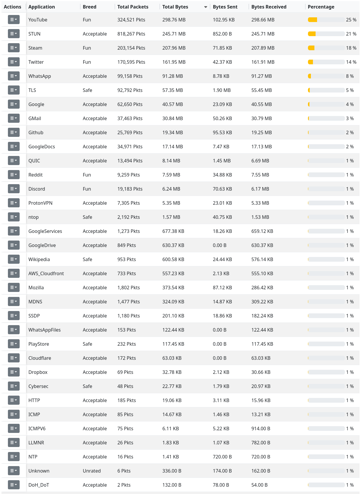

        </div>

### Herramientas gráficas

1. Investigue qué herramientas gráficas existen para monitorear redes y centros de datos. Seleccione una y comente sus funcionalidades.

    Algunas de las herramientas que se utilizan para monitorear redes y centros de datos son Nagios, Grafana, Prometheus, y Cacti. Grafana es una de las que más se utiliza actualmente. Grafana es una plataforma open source que permite el análisis y monitoreo de métricas. Algunas de sus funciones principales son:

    - Utiliza dashboards, son paneles que permiten mostrar gráficas de diferentes tipos. Se pueden usar variables para hacerlos dinámicos, y compartirlos a otros usuarios o exportarlos a JSON.
    - Para obtener métricas, Grafana se conecta a fuentes externas, soportando más de 150 fuentes de datos, entre ellas Prometheus, MySQL, PostgreSQL, CloudWatch, Azure Monitor, Google Cloud Monitoring, entre otros.
    - Permite definir alertas a partir de consultas a fuentes de datos. Cuando una métrica supera un umbral, Grafana puede notificar mediante email, Slack, Telegram, entre otros.
    - Grafana Tempo es un componente que permite trazar el recorrido de una solicitud que pasa por varios microservicios, lo cual puede ser útil para diagnosticar la latencia en arquitecturas complejas.

## Guía de Lectura

De la siguiente lista de herramientas, lea la sinopsis, la descripción y los ejemplos de las páginas de manual correspondiente a cada una de ellas (man herramienta en la terminal o bien [en línea](https://manpages.ubuntu.com/)):

    ps, htop, netstat, ip link, ip addr, ip neigh, ss, mii-tool, ping, arping, traceroute, netperf, iperf, iptraf (paquete iptraf-ng), tcpdump, tshark, rfkill, inxi, wireshark, speedtest (speedtest-cli), vnc (paquete tigervnc-viewer), ssh, dig, nslookup, hping (paquete hping3), iotop, nmcli, curl, wget, smokeping, ab/apachebench (paquete apache2-utils), nmap, nc (paquete netcat), telnet, iw, resolvectl, dsniff, ethtool, nethogs, wrk, sockperf, jmeter, h2load (paquete nghttp2-client)

Categorice las mismas según su objetivo principal:

- Configuración y/o determinación de estado
- Prueba de conectividad
- Determinación y prueba de caminos
- Pruebas de throughput
- Captura de tráfico/paquetes
- Descubrimiento de dispositivos y servicios
- Determinación de la performance
- Pruebas de protocolos de capa de enlace y/o red
- Pruebas de protocolos de capa de aplicación
- Pruebas de seguridad
- Acceso remoto
