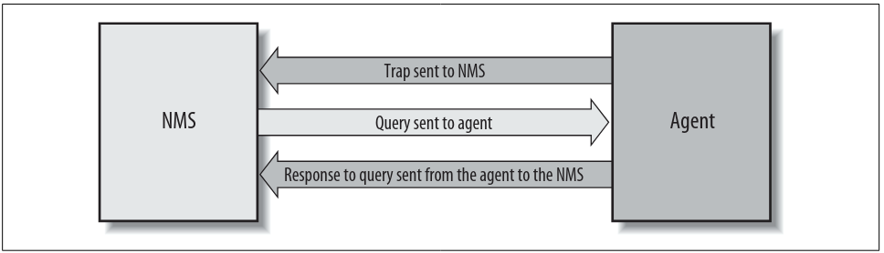

## [Volver atrás](/readme.md)

<h1>Introducción a la Gestión de Redes</h1>

# Bibliografía

- MAURO, D., SCHMIDT. K., 2005, Essential SNMP (2nd ed). O'Reilly Media. Capítulo 1. "Introduction to SNMP and Network Management" (págs. 1-10; omitir sección "Change Management")
- CLEEM, A. 2007. Network Management Fundamentals. CISCO Press. Capítulo 5. "Management Functions and Reference Models: Getting Organized" (págs. 129-166)
- OPPENHEIMER, P., 2011, Top-Down Network Design (3d ed). CISCO Press. Capítulo 9. "Developing Network Management Strategies" (págs. 263-278)
- UIT-T Rec X.700 (FCAPS), X.701, X.733
- RFC 5424 “The Syslog Protocol”

---

# Introducción a SNMP y Gestión de la Red

En la compleja red de routers, switches y servidores que existen en la actualidad, puede resultar difícil manejar todos estos dispositivos y asegurar que funcionen correctamente. El protocolo **SNMP (Simple Network Management Protocol)** permite facilitar esto.

## ¿Qué es SNMP?

SNMP es un conjunto de operaciones que da a los administradores la habilidad de cambiar el estado de un dispositivo basado en SNMP.

Si bien el predecesor de SNMP, el protocolo SGMP (Simple Gateway Management Protocol) fue desarrollado para gestionar routers, SNMP puede ser utilizado para administrar sistemas Unix, Windows, y cualquier otro dispositivo o software que permita la recuperación de información SNMP.

### Managers y Agents

En el mundo de SNMP, hay dos tipos de entidades: managers y agents. Un **manager** es un servidor que corre un software que puede manejar tareas de gestión para una red. Los managers se los conoce como **Network Management Stations (NMS)**. Un NMS es responsable de hacer polling y recibir traps de agenter en la red. Un **poll** es la acción de consultar a un agent (router, switch, servidor Unix, etc.) para obtener información. Esta información puede ser utilizada para determinar si ocurrió algún evento catastrófico. Un **trap** es una manera en la que el agent informe al NMS que pasó algo. Los traps se envían asíncronamente, y no en respuesta a una consulta por parte del NMS. El NMS es responsable de actuar basandose en la información que recibe del agent.

La segunda entidad, el **agent**, es un software que corre en dispositivos de red. Puede ser un programa como un proceso demonio o puede ser incorporado dentro del sistema operativo. El agente provee información de gestión al NMS, mediante el monitoreo de varios aspectos operativos del dispositivo. Cuando el agente detecta que sucede algo malo, puede enviarle un trap al NMS. Algunos dispositivos envían un trap "all clear" cuando hay una transición de un estado malo a uno bueno.

### Structure Management Information y MIBs

El **Structure Management Information (SMI)** provee una manera de definir objetos gestionados y su comportamiento. Un objeto tal es el estado operativo de una interfaz de router (por ejemplo, up, down o testing). Esta lista define la información que el NMS puede usar para determinar la salud del dispositivo en el que el agent reside.

El **Management Information Base (MIB)** es una base de datos de objetos gestionados que el agente monitorea. Cualquier estado o información estadística que puede ser accedida por el NMS está definida en un MIB. El SMI provee una manera de definir objetos gestionados mientras que el MIB es la definición de dichos objetos.

Un agent puede implementar varios MIBs, pero todos los agentes implementan un MIB particular llamado MIB-II. Este estándar define tanto variables para estádisticas de interfaz (velocidad de interfaz, MTU, octetos enviados/recibidos, etc.) como varias otras cosas sobre el sistema en sí mismo. El objetivo principal de MIB-II es brindar información general para la gestión de TCP/IP.

### Gestión de Hosts

Gestionar recursos de host (espacio de disco, uso de memoria, etc.) es una parte importante de la gestión de la red. El Host Resources MIB define un conjunto de objetos que ayudan a manejar aspectos críticos de sistemas Unix y Windows.

Algunos de los objetos soportados por Host Resources MIB incluyen capacidad de disco, número de usuarios, número de procesos corriendo, y software instalado.

### Breve Introducción a Remote Monitoring (RMON)

Remote Monitoring (RMON) provee al NMS estadísticas a nivel de paquete sobre una LAN o WAN entera. RMONv2 provee estadísticas a nivel de red y aplicación. Estas estadísticas se pueden recolectar de varias maneras. Una es poner a un RMON a sondear cada segmento de red que quieras monitorear.

El RMON MIB fue diseñado para permitir que un RMON pueda sondear de manera offline, permitiendo obtener estadísticas sobre la red que está monitoreando sin requerir que un NMS la consulte constantemente. El NMS puede consultar el sondeo para las estadísticas que fue recolectando. Otra característica que muchos sondeos implementan es la habilidad de definir umbrales para varias condiciones de error y, cuando se supera un umbral, alerta al NMS enviando un trap SNMP.

## El Concepto de Gestión de Redes

¿Qué es la gestión de redes? La gestión de redes es un concepto general que emplea el uso de varias herramientas, técnicar, y sistemas para asistir a las personas en la gestión de diversos dispositivos, sistemas o redes. Un modelo de referencia de gestión de redes, conocido como **FCAPS**, consiste en la gestión de fallas, gestión de configuración, gestión de contabilidad, gestión de rendimiento y gestión de seguridad. Estas áreas conceptuales fueron creadas por la International Organization for Standardization (ISO) para facilitar la comprensión de las funciones importantes de los sistemas de gestión de redes.

Un modelo de referencia puede ser usado como guía y ayuda a orientarse de las siguientes maneras:

- Facilita verificar la integridad de un sistema de gestión o una infraestructura de soporte de operaciones. Obliga a la persona que aplica el modelo a diferenciar las tareas que deben realizarse.
- Ayuda a categorizar y agrupar funciones diferentes, e identificar cuales están relacionadas o no.
- Ayuda a identificar escenarios y casos de uso que necesitan ser recolectados, y a reconocer las interdependencias e interfaces entre las diferentes tareas.

Los modelos de referencia son conceptuales. Por lo general, no hay necesidad de que un sistema siga literalmente la estructura de un modelo de referencia. Los modelos de referencia deben ser aplicados generalmente y no pueden ser optimizados para un caso específico.

### Fault Management

El objetivo de la gestión de fallas (fault management) es detectar, registrar, y notificar a los usuarios de sistemas o redes de los problemas. En muchos entornos, no se acepta la interrupción del servicio.

La gestión de fallas incluye las siguientes funciones:

- Monitoreo de la red, incluyendo la gestión de alarmas
- Diagnóstico de fallas, análisis de causa-raíz y resolución de problemas
- Mantenimiento de logs históricos de alarmas
- Gestión de tickets
- Gestión proactiva de fallas

La gestión de fallas dicta que se deben realizar estos pasos para la resolución de fallas:

1. Aislar el problema utilizando herramientas para determinar síntomas.
2. Resolver el problema.
3. Registrar el proceso que fue utilizado para detectar y resolver el problema.

### Configuration Management

El objetivo de la gestión de configuración (configuration management) es monitorear la información de configuración de la red y del sistema para gestionar y monitorear los efectos que tienen las diversas versiones de hardware y software sobre el funcionamiento de la red.

Esta información normalmente se almacena en una base de datos. Esta base de datos se actualiza a medida que se modifican los parámetros de configuración del sistema. Una ventaja de almacenar estos datos es que puede asistir en la resolución de problemas.

### Accounting Management

El objetivo de la gestión de contabilidad (accounting management) es asegurar que los recursos de computación y de red son usados de manera justa por todos los grupos o individuos que los acceden. Mediante esta regulación, los problemas de red pueden ser minimizados ya que los recursos son divididos según las capacidades.

### Performance Management

El objetivo de la gestión de rendimiento (performance management) es medir y reportar sobre varios aspectos del rendimiento de la red o del sistema.

Los pasos involucrados en la gestión de rendimiento son:

1. Se recolectan datos de rendimiento.
2. Se establecen niveles de referencia en base al análisis de los datos recolectados.
3. Se establecen umbrales de rendimiento. Cuando estos umbrales son superados, es una indicación de que hay un problema que requiere atención.

Otro ejemplo de gestión de rendimiento es el monitoreo de servicios, por ejemplo, un proveedor de servicio de Internet puede estar interesado en monitorear el tiempo de respuesta de su servicio de email. Esto incluye enviar emails mediante SMTP y obtener emails mediante POP3.

### Security Management

El objetivo de la gestión de seguridad (security management) se divide en dos. Primero, queremos controlar el acceso a algún recurso, como la red y sus hosts. Segundo, queremos ayudar a detectar y prevenir ataques que pueden comprometer a la red y sus hosts. Los ataques sobre redes y hosts puede llevar a la interrupción del servicio e incluso al acceso de sistemas vitales que contienen datos sobre el código fuente, pagos y contabilidad.

La gestión de la seguridad no sólo comprende los sistemas de seguridad de red sino también la seguridad física. La seguridad física incluye sistemas de acceso por tarjeta y sistemas de videovigilancia. El objetivo es asegurar que sólo las personas autorizadas tienen acceso físico a sistemas vulnerables.

Hoy en día, la gestión de la seguridad se logra mediante el uso de varias herramientas y sistemas diseñados específicamente para este propósito, como los siguientes:

- Firewalls
- Sistemas de Detección de Intrusión (IDS)
- Sistemas de Prevención de Intrución (IPS)
- Sistemas de Antivirus
- Sistemas de gestión y aplicación de políticas

## Aplicando los Conceptos de la Gestión de Redes

Ser capaz de aplicar los conceptos de la gestión de redes es tan importante como aprender a usar SNMP. La siguiente sección provee información sobre algunos problemas que ocurren durante la gestión de la red.

### Requisitos de Caso de Negocio

La gestión de redes implica resolver un problema de negocio mediante algún tipo de implementación. Un caso de negocio es desarrollado para entender el impacto de la implementación de una tarea o función. La idea es reducir costos e incrementar la efectividad. No hay necesidad de implementar una solución si no le ahorra dinero a una empresa mientras ofrezca servicios más efectivos.

### Niveles de actividad

Antes de gestionar un servicio o dispositivo, se deben entender los cuatro niveles posibles de actividad y decidir qué es apropiado hacer para ese servicio o dispositivo:

- **Inactivo**: no se está realizando ningún monitoreo, y si se recibe una alarma, se ignora.
- **Reactivo**: no se está realizando ningún monitoreo, se reacciona a un problema si ocurre.
- **Interactivo**: se monitorean los componentes pero se deben diagnosticar interactivamente para eliminar alarmas debido a efectos secundarios y aislar la causa principal.
- **Proactivo**: se monitorean los componentes, y el sistema provee una alarma para la causa principal del problema e inicia procesos de restauración automáticos y predefinidos, posiblemente minimizando la interrupción del servicio.

### Informes de Análisis de Tendencias

La habilidad para monitorear un servicio o sistema empieza con el análisis de tendencias y los informes. El objetivo del análisis de tendencias es identificar cuando los sistemas, servicios o redes empiezan a alcanzar su capacidad máxima, dando el tiempo suficiente para hacer algo antes de que empiece a ser un problema para los usuarios finales.

### Informes de Tiempo de Respuesta

El informe de tiempos de respuesta mide cómo los diferentes aspectos de la red están funcionando en cuanto a capacidad de respuesta.

### Correlación de Alarmas

La correlación de alarmas lidia con agrupar varias alertas y eventos en una sola alerta o en muchos eventos que describen el problema. 

También es importante limpiar las alarmas. Por ejemplo, cuando un router vuelve a funcionar, envía un mensaje SNMP o un NMS lo detecta y crea una alarma. Esta noción de que hubo una transición de un estado malo a uno bueno ayuda a los operadores saber que algo realmente está funcionando como debe.

### Resolución de Problemas

La clave para la resolución de problemas es saber que lo que estas viendo es valuable y que puede ayudar a resolver el problema. Las alarmas y alertas deben asistir a un operador, brindando los detalles suficientes para poder diagnosticar el problema y resolverlo.

---
