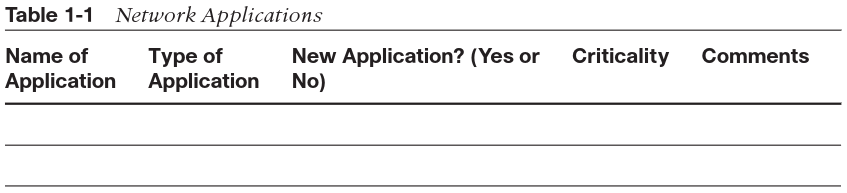

## [Volver atrás](/readme.md)

<h1>Diseño de Redes</h1>

# Bibliografía

- OPPENHEIMER, P., 2011, Top-Down Network Design (3d ed).
    - Capítulo 1. "Analyzing Business Goals and Constraints" (pp. 3-24)
    - Capítulo 2. "Analyzing Technical Goals and Tradeoffs" (pp. 25-57)
    - Capítulo 5. "Designing a Network Topology" (pp. 119-165)
    - Capítulo 14. "Documenting Your Network Design" (pp. 393-405)
- MCCABE, J. D., 2007, Network Analysis, Architecture and Design. 3rd ed.
    - Capítulo 4. "Flow Analysis"
    - Capítulo 5. "Network Architecture"
- KENYON, T., 2002, High Performance Data Network Design: Design Techniques and Tools.
    - Capítulo 3. Sección 3.1. "Hierarchical design model" (pp. 91-99)

---

# Analyzing Business Goals and Constraints

## Using a Top-Down Network Design Methodology

Good network design must recognize that a customer’s requirements embody many business and technical goals, including requirements for availability, scalability, affordability, security, and manageability. Many customers also want to specify a required level of network performance, often called a **service level**. To meet these needs, difficult network design choices and tradeoffs must be made when designing the logical network before any physical devices or media are selected.

Top-down network design is a methodology for designing networks that begins at the upper layers of the OSI reference model before moving to the lower layers. The top-down methodology focuses on applications, sessions, and data transport before the selection of routers, switches, and media that operate at the lower layers.

The top-down network design process includes exploring organizational and group structures to find the people for whom the network will provide services and from whom the designer should get valuable information to make the design succeed.

Top-down network design is also iterative. To avoid getting bogged down in details too quickly, it is important to first get an overall view of a customer’s requirements. Later, more detail can be gathered on protocol behavior, scalability requirements, technology preferences, and so on. Top-down network design recognizes that the logical model and the physical design can change as more information is gathered.

### Using a Structured Network Design Process

Structured systems analysis has the following characteristics:

- The system is designed in a top-down sequence.
- During the design project, several techniques and models can be used to characterize the existing system, determine new user requirements, and propose a structure for the future system.
- A focus is placed on data flow, data types, and processes that access or change the data.
- A focus is placed on understanding the location and needs of user communities that access or change data and processes.
- A logical model is developed before the physical model. The logical model represents the basic building blocks, divided by function, and the structure of the system. The physical model represents devices and specific technologies and implementations.
- Specifications are derived from the requirements gathered at the beginning of the top-down sequence.

With large network design projects, modularity is essential. The design should be split functionally to make the project more manageable. Each module is designed separately, yet in relation to other modules. All the modules are designed using a top-down approach that focuses on requirements, applications, and a logical structure before the selection of physical devices and products to implement the design.

### Systems Development Life Cycles

Most systems, including network systems, follow a cyclical set of phases, where the system is planned, created, tested, and optimized. Feedback from the users of the system causes the system to then be redesigned or modified, tested, and optimized again. New requirements arise as the network opens the door to new uses. As people get used to the new network and take advantage of the services it offers, they soon take it for granted and expect it to do more.

Network design is divided into four major phases that are carried out in a cyclical fashion:

- Analyze requirements: In this phase, the network analyst interviews users and technical personnel to gain an understanding of the business and technical goals for a new or enhanced system. The task of characterizing the existing network, including the logical and physical topology and network performance, follows. The last step in this phase is to analyze current and future network traffic, including traffic flow and load, protocol behavior, and quality of service (QoS) requirements.
- Develop the logical design: This phase deals with a logical topology for the new or enhanced network, network layer addressing, naming, and switching and routing protocols. Logical design also includes security planning, network management design, and the initial investigation into which service providers can meet WAN and remote access requirements.
- Develop the physical design: During the physical design phase, specific technologies and products that realize the logical design are selected. Also, the investigation into service providers, which began during the logical design phase, must be completed during this phase.
- Test, optimize, and document the design: The final steps in top-down network design are to write and implement a test plan, build a prototype or pilot, optimize the network design, and document your work with a network design proposal.

## Analyzing Business Goals

### Working with Your Client

Before meeting with your customer to discuss business goals for the network design project, it is a good idea to research your client’s business. With the knowledge of your customer’s business and its external relations, you can position technologies and products to help strengthen the customer’s status in the customer’s own industry.

In your first meeting with your customers, ask them to explain the organizational structure of the company. Your final internetwork design will probably reflect the corporate structure. Understanding the corporate structure can help you locate major user communities and characterize traffic flow.

After discussing the overall business goals of the network design project, ask your customer to help you understand the customer’s criteria for success. What goals must be met for the customer to be satisfied? Sometimes success is based on operational savings because the new network allows employees to be more productive. Sometimes success is based on the ability to increase revenue or build partnerships with other companies.

In addition to determining the criteria for success, you should ascertain the consequences of failure:

- What will happen if the network design project fails or if the network, when installed, does not perform to specification?
- How visible is the project to upper-level management?
- Will the success (or possible failure) of the project be visible to executives?
- To what extent could unforeseen behavior of the new network disrupt business operations?

### Changes in Enterprise Networks

A network that is used by only internal users is no longer the norm at many companies. Companies are seeking ways to build networks that more closely resemble modern organizations. Many modern organizations are based on an open, collaborative environment that provides access to information and services for many different constituents, including customers, prospective customers, vendors, suppliers, and employees.

To remain competitive, companies need ways to reduce product development time and take advantage of just-in-time manufacturing principles. A lot of companies achieve these goals by partnering with suppliers and by fostering an online, interactive relationship with their suppliers.

A network designer must carefully consider requirements for extending the network to outside users. For security reasons, external access should not mean full network access. Using a modular approach to network design is important here so that a clear boundary exists between the enterprise’s private networks and the portions of the internetwork that partners can access.

### Networks Must Make Business Sense

Network applications have become mission critical. Despite this trend, large budgets for networking and telecommunications operations have been reduced at some companies. Many companies have gone through difficult reengineering projects to reduce operational costs and are still looking for ways to manage networks with fewer resources and to reduce the recurring costs of WAN circuits.

Companies are researching ways to make their data centers more efficient in their usage of power, cabling, racks, storage, and WAN circuits. Companies seek to reduce data center costs and to make data centers more “green” (whereby energy usage is reduced). Data center managers have discovered that many of their servers’ CPUs are underutilized. A major trend in enterprise network design is server virtualization, where one hardware platform supports multiple virtual servers.

### Networks Offer a Service

As a network designer, you might find yourself working with IT architects who adhere to the IT Service Management (ITSM) discipline. ITSM defines frameworks and processes that can help an organization match the delivery of IT services with the business needs of the organization.

Other trends in IT management that affect network design are related to governance and compliance. **Governance** refers to a focus on consistent, cohesive decisions, policies, and processes that protect an organization from mismanagement and illegal activities of users of IT services. **Compliance** refers to adherence to regulations that protect against fraud and inadvertent disclosure of private customer data.

### The Need to Support Mobile Users

Users should have secure and reliable access to tools and data wherever they are. The challenge for network designers is to build networks that allow data to travel in and out of the enterprise network from various wired and wireless portals without picking up any viruses and without being read by parties for whom it was not intended.

One of the biggest trends in network design is virtual private networking (VPN), where private networks make use of the Internet to reach remote locations or possibly other organizations.

### The Importance of Network Security and Resiliency

Enterprises must protect their networks from both the unsophisticated “script kiddies” and from more advanced attacks launched by criminals or political enemies. There is also a continued requirement to protect networks from Trojan horses and viruses.

Many enterprise managers now report that the network must be available 99.999 percent of the time. Although this goal might not be achievable without expensive redundancy in staff and equipment, it might be a reasonable goal for companies that would experience a severe loss of revenue or credibility if the network were down for even short periods of time. This goal is linked to goals for security, as the network can’t be available if security breaches and viruses are disabling network devices and applications. When security and operational problems occur, networks must recover quickly. Networks must be resilient.

One aspect of analyzing a customer’s business goals is the process of analyzing vulnerabilities related to disasters and the impact on business operations. Help your customer determine which network capabilities are critical and which facilities provide them. Consider how much of the network could be damaged without completely disrupting the company’s mission. Determine whether other locations in the company are prepared to take on mission-critical functions.

### Typical Network Design Business Goals

After considering the changes in business strategies and enterprise networking discussed in the previous sections, it is possible to list some typical network design business goals:

- Increase revenue and profit
- Increase market share
- Expand into new markets
- Increase competitive advantages over companies in the same market
- Reduce costs
- Increase employee productivity
- Shorten product-development cycles
- Use just-in-time manufacturing
- Plan around component shortages
- Offer new customer services
- Offer better customer support
- Open the network to key constituents (prospects, investors, customers, business partners, suppliers, and employees)
- Avoid business disruption caused by network security problems
- Avoid business disruption caused by natural and unnatural disasters
- Modernize outdated technologies
- Reduce telecommunications and network costs, including overhead associated with separate networks for voice, data, and video
- Make data centers more efficient in their usage of power, cabling, racks, storage, and WAN circuits
- Comply with IT architecture design and governance goals

### Identifying the Scope of a Network Design Project

One of the first steps in starting a network design project is to determine its scope. Ask your customer to help you understand if the design is for a single network segment, a set of LANs, a set of WANs or remote-access networks, or the entire enterprise network. Also ask your customer if the design is for a new network or a modification to an existing one.

When analyzing the scope of a network design, you can refer to the seven layers of the OSI reference model to specify the types of functionality the new network design must address.

This book also uses the following terms to define the scope of a network and the scope of a network design project:

- Segment: A single network bounded by a switch or router and based on a particular Layer 1 and Layer 2 protocol such as Fast Ethernet.
- LAN: A set of switched segments based on a particular Layer 2 protocol such as Fast Ethernet and an interswitch trunking protocol such as the IEEE 802.1Q standard.
- Building network: Multiple LANs within a building, usually connected to a building backbone network.
- Campus network: Multiple buildings within a local geographical area (within a few miles), usually connected to a campus-backbone network.
- Remote access: Networking solutions that support individual remote users or small remote branch offices accessing the network.
- WAN: A geographically dispersed network including point-to-point, Frame Relay, ATM, and other long-distance connections.
- Wireless network: A LAN or WAN that uses the air (rather than a cable) for its medium.
- Enterprise network: A large and diverse network, consisting of campuses, remote access services, and one or more WANs or long-range LANs. An enterprise network is also called an internetwork.

### Identifying a Customer’s Network Applications

The identification of your customer’s applications should include both current applications and new applications. Ask your customer to help you fill out a chart, such as the one in Table 1-1.

## Analyzing Business Constraints

### Politics and Policies

