## [Volver atrás](/readme.md)

<h1>Protocolo SNMP</h1>

# Bibliografía

- MAURO, D., SCHMIDT, K. Essential SNMP (2da Ed.), Douglas R. Mauro and Kevin J. Schmidt. 
    - Capítulo 1: “Introduction to SNMP and Network Management”
    - Capítulo 2: “SNMPv1 and SNMPv2”
    - Capítulo 3: “SNMPv3”
- GORALSKI, W. 2017. The Illustrated Network: How TCP/IP Works in a Modern Network (2nd ed).
    - Capítulo 28: “Simple Network Management Protocol (SNMP)”
- http://www.snmp.com/snmpv3/snmpv3_intro.shtml
- RFC's 2578, 1213, 3411-3418, 5590

---

# Introduction to SNMP and Network Management

## What Is SNMP?

Simple Network Management Protocol (SNMP) is a simple set of operations (and the information these operations gather) that gives administrators the ability to change the state of some SNMP-based device. Any device running software that allows the retrieval of SNMP information can be managed. This includes not only physical devices but also software.

### RFCs and SNMP Versions

- SNMP Version 1 (SNMPv1) is the initial version of the SNMP protocol. It’s defined in RFC 1157 and is a historical IETF standard. SNMPv1’s security is based on communities, which are nothing more than passwords: plain-text strings that allow any SNMP-based application that knows the strings to gain access to a device’s management information. There are typically three communities in SNMPv1: read-only, read-write, and trap.
- SNMP version 2 (SNMPv2) is often referred to as community-string-based SNMPv2. This version of SNMP is technically called SNMPv2c, but we will refer to it throughout this book simply as SNMPv2.
- SNMP version 3 (SNMPv3) is the latest version of SNMP. Its main contribution to network management is security. It adds support for strong authentication and private communication between managed entities

### Managers and Agents

A **manager** is a server running some kind of software system that can handle management tasks for a network. Managers are often referred to as **Network Management Stations (NMSs)**. An NMS is responsible for polling and receiving traps from agents in the network. A **poll**, in the context of network management, is the act of querying an agent (router, switch, Unix server, etc.) for some piece of information. This information can be used later to determine if some sort of catastrophic event has occurred. A **trap** is a way for the agent to tell the NMS that something has happened. Traps are sent asynchronously, not in response to queries from the NMS. The NMS is further responsible for performing an action† based upon the information it receives from the agent.

The **agent** is a piece of software that runs on the network devices you are managing. It can be a separate program (a daemon, in Unix language), or it can be incorporated into the operating system. Today, most IP devices come with some kind of SNMP agent built in. The agent provides management information to the NMS by keeping track of various operational aspects of the device. When the agent notices that something bad has happened, it can send a trap to the NMS. This trap originates from the agent and is sent to the NMS, where it is handled appropriately. Some devices will send a corresponding “all clear” trap when there is a transition from a bad state to a good state. This can be useful in determining when a problem situation has been resolved.

### The Structure of Management Information and MIBs

The Structure of Management Information (SMI) provides a way to define managed objects and their behavior. An agent has in its possession a list of the objects that it tracks.

The Management Information Base (MIB) can be thought of as a database of man aged objects that the agent tracks. Any sort of status or statistical information that can be accessed by the NMS is defined in a MIB. The SMI provides a way to define managed objects while the MIB is the definition (using the SMI syntax) of the objects themselves.

An agent may implement many MIBs, but all agents implement a particular MIB called MIB-II (RFC 1213). This standard defines variables for things such as interface statistics (interface speeds, MTU, octets sent, octets received, etc.) as well as various other things pertaining to the system itself (system location, system contact, etc.). The main goal of MIB-II is to provide general TCP/IP management information.

Vendors, and individuals, are allowed to define MIB variables for their own use. For example, consider a vendor that is bringing a new router to market. The agent built into the router will respond to NMS requests (or send traps to the NMS) for the variables defined by the MIB-II standard; it probably also implements MIBs for the interface types it provides. In addition, the router may have some significant new features that are worth monitoring but are not covered by any standard MIB. So, the vendor defines its own MIB (sometimes referred to as a proprietary MIB) that implements managed objects for the status and statistical information of its new router.

### A Brief Introduction to Remote Monitoring (RMON)

Remote Monitoring Version 1 (RMONv1) provides the NMS with packet-level statistics about an entire LAN or WAN. RMONv2 builds on RMONv1 by providing network and application-level statistics. These statistics can be gathered in several ways. One way is to place an RMON probe on every network segment you want to monitor.

The RMON MIB was designed to allow an actual RMON probe to run in an offline mode that allows the probe to gather statistics about the network it’s watching without requiring an NMS to query it constantly. At some later time, the NMS can query the probe for the statistics it has been gathering. Another feature that most probes implement is the ability to set thresholds for various error conditions and, when a threshold is crossed, alert the NMS with an SNMP trap.

## The Concept of Network Management

Network management is a general concept that employs the use of various tools, techniques, and systems to aid human beings in managing various devices, systems, or networks. Let’s look at a model for network management called **FCAPS**, or Fault Management, Configuration Management, Accounting Management, Performance Management, and Security Management. These conceptual areas were created by the International Organization for Standardization (ISO) to aid in the understanding of the major functions of network management systems.

### Fault Management

The goal of fault management is to detect, log, and notify users of systems or networks of problems. In many environments, downtime of any kind is not acceptable. Fault management dictates that these steps for fault resolution be followed:
1. Isolate the problem by using tools to determine symptoms.
2. Resolve the problem.
3. Record the process that was used to detect and resolve the problem.

### Configuration Management

The goal of configuration management is to monitor network and system configuration information so that the effects on network operation of various versions of hardware and software elements can be tracked and managed.

### Accounting Management

The goal of accounting management is to ensure that computing and network resources are used fairly by all groups or individuals who access them. Through this form of regulation, network problems can be minimized since resources are divided based on capacities.

### Performance Management

The goal of performance management is to measure and report on various aspects of network or system performance. The steps involved in performance management are the following:
1. Performance data is gathered.
2. Baseline levels are established based on analysis of the data gathered.
3. Performance thresholds are established. When these thresholds are exceeded, it is indicative of a problem that requires attention.

### Security Management

The goal of security management is twofold. First, we wish to control access to some resource, such as a network and its hosts. Second, we wish to help detect and prevent attacks that can compromise networks and hosts. Attacks against networks and hosts can lead to denial of service and, even worse, allow hackers to gain access to vital systems that contain accounting, payroll, and source code data. Security management encompasses not only network security systems but also physical security. Physical security includes card access and video surveillance systems. The goal here is to ensure that only authorized individuals have physical access to vulnerable systems.

Today, network security management is accomplished through the use of various tools and systems designed specifically for this purpose. These include:
- Firewalls
- Intrusion Detection Systems (IDSs)
- Intrusion Prevention Systems (IPSs)
- Antivirus systems
- Policy management and enforcement systems

Most if not all of today’s network security systems can integrate with network management systems via SNMP.

## Applying the Concepts of Network Management

### Business Case Requirements

The endeavor of network management involves solving a business problem through an implementation of some sort. A business case is developed to understand the impact of implementing some sort of task or function. The basic idea is to reduce costs and increase effectiveness. If the implementation doesn’t save a company any money while providing more effective services, there is almost no need to implement a given solution.

### Levels of Activity

Before applying management to a specific service or device, you must understand the four possible levels of activity and decide what is appropriate for that service or device:
- Inactive: No monitoring is being done, and, if you did receive an alarm in this area, you would ignore it.
- Reactive: No monitoring is being done; you react to a problem if it occurs.
- Interactive: You monitor components but must interactively troubleshoot them to eliminate side-effect alarms and isolate a root cause.
- Proactive: You monitor components, and the system provides a root-cause alarm for the problem at hand and initiates predefined automatic restoral processes where possible to minimize downtime.

### Reporting of Trend Analysis

The goal of trend analysis is to identify when systems, services, or networks are beginning to reach their maximum capacity, with enough lead time to do something about it before it becomes a real problem for end users. 

### Response Time Reporting

Response time reporting measures how various aspects of your network (including systems) are performing withrespect to responsiveness.

### Alarm Correlation

Alarm correlation deals with narrowing down many alerts and events into a single alert or several events that depict the real problem. Another name for this is root cause analysis.

### Trouble Resolution

The key to trouble resolution is knowing that what you are looking at is valuable and can help you resolve the problem. If possible, alerts and alarms should provide the operator with enough detail so that they can effectively troubleshoot and resolve the problem.

## Change Management

You need to plan for both scheduled and emergency changes to your network. Not doing so can cause networks and systems to be unreliable at best and can upset the very people you work for at worst. 

### Planning for Change

Change planning is a process that identifies the risk level of a change and builds change planning requirements to ensure that the change is successful. The key steps for change planning are as follows:
- Assign all potential changes a risk level prior to scheduling the change.
- Document at least three risk levels with corresponding change planning requirements. Identify risk levels for software and hardware upgrades, topology changes, routing changes, configuration changes, and new deployments. Assign higher risk levels to nonstandard add, move, or change types of activity.
- The high-risk change process you document needs to include lab validation, vendor review, peer review, and detailed configuration and design documentation.
- Create solution templates for deployments affecting multiple sites. Include information about physical layout, logical design, configuration, software versions, acceptable hardware chassis and modules, and deployment guidelines.
- Document your network standards for configuration, software version, supported hardware, and DNS. Additionally, you may need to document things like device naming conventions, network design details, and services supported throughout the network.

### Managing Change

Change management is a process that approves and schedules the change to ensure the correct level of notification with minimal user impact. The key steps for change management are as follows:
- Assign a change controller who can run change management review meetings, receive and review change requests, manage change process improvements, and act as a liaison for user groups.
- Hold periodic change review meetings with system administration, application development, network operations, and facilities groups as well as general users.
- Document change input requirements, including change owner, business impact, risk level, reason for change, success factors, backout plan, and testing requirements.
- Document change output requirements, including updates to DNS, network map, template, IP addressing, circuit management, and network management.
- Define a change approval process that verifies validation steps for higher-risk change.
- Hold postmortem meetings for unsuccessful changes to determine the root cause of change failure.
- Develop an emergency change procedure that ensures that an optimal solution is maintained or quickly restored.

### High-Level Process Flow for Planned Change Management

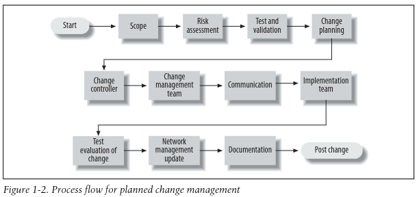

- Scope: Scope is the who, what, where, and how for the change. In other words, you need to detail every possible impact point for the change, especially its impact on people.
- Risk assessment: Everything you do to or on a network, when it comes to change, has an associated risk. The person requesting the change needs to establish the risk level for the change. It is best to experiment in a lab setting if you can before you go live with a change.
- Test and validation: With any proposed change, you want to make sure you have all of your bases covered. Rigorous testing and validation can help with this. Depending upon the associated risk, various levels of validation may need to be performed. If the change doesn’t work, you may also need to document backout procedures.
- Change planning: For a change to be successful, you must plan for it. This includes  equirements gathering, ordering software or hardware, creating documentation, and coordinating human resources.
- Change controller: Basically, a change controller is a person who is responsible for coordinating all details of the change process.
- Change management team: You should create a change management team that includes representation from net-
work operations, server operations, application support, and user groups within your organization. The team should review all change requests and approve or deny each request based on completeness, readiness, business impact, business need, and any other conflicts.
- Communication: Many organizations, even small ones, fail to communicate their intentions. Make sure you keep people who may be affected up-to-date on the status of the changes.
- Implementation team: You should create an implementation team consisting of individuals with the techni-
cal expertise to expedite a change. The implementation team should also be involved in the planning phase to contribute to the development of the project checkpoints, testing, backout criteria, and backout time constraints. This team should guarantee adherence to organizational standards, update DNS and network management tools, and maintain and enhance the tool set used to test and validate the change.
- Test evaluation of change: Once the change has been made, you should begin testing it. Hopefully you already have a set of tests documented that can be used to validate the change. Make sure you allow yourself enough time to perform the tests. If you must back out the change, make sure you test this scenario, too.
- Network management update: Be sure to update any systems like network management tools, device configurations, network configurations, DNS entries, etc., to reflect the change. This may include removing devices from the management systems that no longer exist, changing the SNMP trap destination your routers use, and so forth.
- Documentation: Always update documentation that becomes obsolete or incorrect when a change occurs. Documentation may end up being used by a network administrator to solve a problem. If it isn’t up-to-date, he cannot be effective in his duties.

### High-Level Process Flow for Emergency Change Management

Documentation means a lot more during emergency changes than it does in planned changes. In the heat of the moment, things can get lost or forgotten. Accurately recording the steps and procedures taken will ensure that troubles can be resolved in the future.

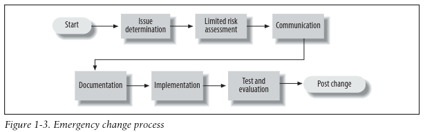

- Issue determination: Knowing what needs to change is generally not difficult to determine in an emergency. The key is to take one step at a time and not rush things.
- Limited risk assessment: Risk assessment is performed by the network administrator on duty, with advice from other support personnel. Her experience will guide her in how the change is classified from a risk perspective.
- Communication and documentation: If at all possible, users should be notified of the change. In an emergency situation, it isn’t always possible. Also, be sure to communicate any changes with the change manager. The manager will wish to add to any metrics he keeps on changes. Ensuring that documentation is up-to-date cannot be stressed enough.
- Implementation: If the process of assigning risk and documentation occurs prior to the implementation, the actual implementation should be straightforward. Beware of the potential for change coming from multiple support personnel without their knowing about each other’s changes. This scenario can lead to increased potential downtime and misinterpretation of the problem.
- Test and evaluation: Be sure to test the change. Generally, the person who implemented the change also tests and evaluates it. The primary goal is to determine whether the change had the desired effect. If it did not, the emergency change process must be restarted.

## Before and After 

Instead of waiting for someone to notice that something is wrong and locate the person responsible for fixing the problem, SNMP allows you to monitor your network constantly, even when you’re not there.

SNMP enables you to keep logs that prove your network is running reliably and show when you took action to avert an impending crisis.

## Staffing Considerations

Implementing a network management system can mean adding more staff to handle the increased load of maintaining and operating such an environment. At the same time, adding this type of monitoring should, in most cases, reduce the workload of your system administration staff. You will need:
- Staff to maintain the management station. This includes ensuring the management station is configured to properly handle events from SNMP-capable devices.
- Staff to maintain the SNMP-capable devices. This includes making sure that workstations and servers can communicate with the management station.
- Staff to watch and fix the network. This group is usually called a Network Operations Center (NOC) and is staffed 24/7. 

---

# SNMPv1 and SNMPv2

## SNMP and UDP

SNMP uses the User Datagram Protocol (UDP) as the transport protocol for passing data between managers and agents. UDP was chosen over TCP because it is connectionless; that is, no end-to-end connection is made between the agent and the NMS when datagrams (packets) are sent back and forth. This aspect of UDP makes it unreliable since there is no acknowledgment of lost datagrams at the protocol level. It’s up to the SNMP application to determine if datagrams are lost and retransmit them if it so desires. This is typically accomplished with a simple timeout. The NMS sends a UDP request to an agent and waits for a response. If the timeout is reached and the NMS has not heard back from the agent, it assumes the packet was lost and retransmits the request. 

If an agent sends a trap and the trap never arrives, the NMS has no way of knowing that it was ever sent. The agent doesn’t even know that it needs to resend the trap because the NMS is not required to send a response back to the agent acknowledging receipt of the trap.

The upside to the unreliable nature of UDP is that it requires low overhead, so the impact on your network’s performance is reduced.

SNMP uses UDP port 161 for sending and receiving requests and port 162 for receiv-
ing traps from managed devices.

When either an NMS or an agent wishes to perform an SNMP function (e.g., a request or trap), the following events occur in the protocol stack:
- Application: First, the actual SNMP application decides what it’s going to do. The application layer provides services to an end user.
- UDP: The next layer, UDP, allows two hosts to communicate with one another. The UDP header contains, among other things, the destination port of the device to which it’s sending the request or trap. The destination port will either be 161 (query) or 162 (trap).
- IP: The IP layer tries to deliver the SNMP packet to its intended destination, as specified by its IP address.
- Media Access Control (MAC): The final event that must occur for an SNMP packet to reach its destination is for it to be handed off to the physical network, where it can be routed to its final destination. The MAC layer is composed of the actual hardware and device drivers that put your data onto a physical piece of wire, such as an Ethernet card. The MAC layer is also responsible for receiving packets from the physical network and sending them back up the protocol stack so that they can be processed by the application layer (SNMP, in this case).

## SNMP Communities

SNMPv1 and SNMPv2 use the notion of communities to establish trust between managers and agents. An agent is configured with three community names: read-only, read-write, and trap. The trap community string allows you to receive traps (asynchronous notifications) from the agent.

The problem with SNMP’s authentication is that community strings are sent in plain text, which makes it easy for people to intercept them and use them against you. SNMPv3 addresses this by allowing secure authentication and communication between SNMP devices.

There are ways to reduce your risk of attack. IP firewalls or filters minimize the chance that someone can harm any managed device on your network by attacking it through SNMP. You can configure your firewall to allow UDP traffic from only a list of known hosts. Firewalls aren’t 100% effective, but simple precautions such as these do a lot to reduce your risk.

## The Structure of Management Information

The definition of managed objects can be broken down into three attributes:
- Name: The name, or object identifier (OID), uniquely defines a managed object. Names commonly appear in two forms: numeric and “human readable.” In either case, the names are long and inconvenient. In SNMP applications, a lot of work goes into helping you navigate through the namespace conveniently.
- Type and syntax: A managed object’s datatype is defined using a subset of Abstract Syntax Notation One (ASN.1). ASN.1 is a way of specifying how data is represented and transmitted between managers and agents, within the context of SNMP. The nice thing about ASN.1 is that the notation is machine independent.
- Encoding: A single instance of a managed object is encoded into a string of octets using the Basic Encoding Rules (BER). BER defines how the objects are encoded and decoded so that they can be transmitted over a transport medium such as Ethernet.

### Naming OIDs

Managed objects are organized into a treelike hierarchy. This structure is the basis for SNMP’s naming scheme. An object ID is made up of a series of integers based on the nodes in the tree, separated by dots (.). Although there’s a human-readable form that’s friendlier than a string of numbers, this form is nothing more than a series of names separated by dots, each representing a node of the tree. You can use the numbers themselves, or you can use a sequence of names that represent the numbers.

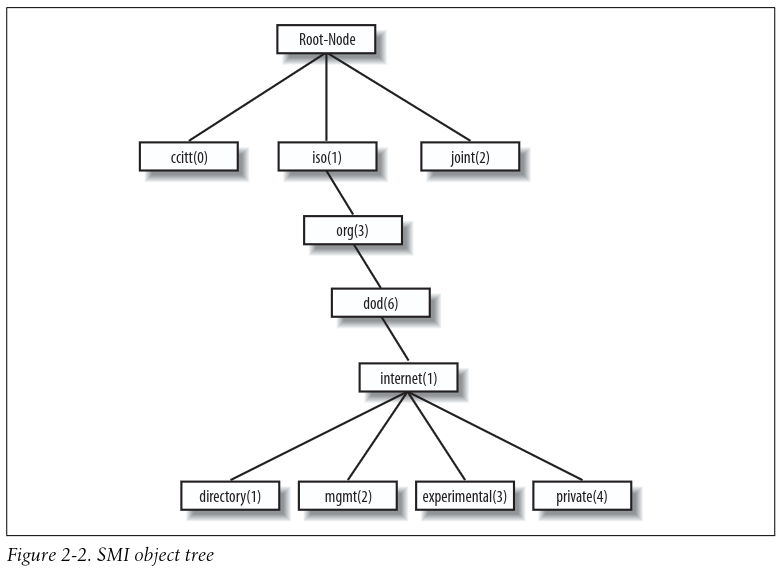

The directory branch currently is not used. The management branch, or mgmt, defines a standard set of Internet management objects. The experimental branch is reserved for testing and research purposes. Objects under the private branch are defined unilaterally, which means that individuals and organizations are responsible for defining the objects under this branch. Here is the definition of the internet subtree, as well as all four of its subtrees:

    internet OBJECT IDENTIFIER ::= { iso org(3) dod(6) 1 }
    directory OBJECT IDENTIFIER ::= { internet 1 }
    mgmt OBJECT IDENTIFIER ::= { internet 2 }
    experimental OBJECT IDENTIFIER ::= { internet 3 }
    private OBJECT IDENTIFIER ::= { internet 4 }

The first line declares internet as the OID 1.3.6.1, which is defined (the ::= is a definition operator) as a subtree of iso.org.dod, or 1.3.6. The last four declarations are similar, but they define the other branches that belong to internet. For the directory branch, the notation { internet 1 } tells us that it is part of the internet subtree and that its OID is 1.3.6.1.1. The OID for mgmt is 1.3.6.1.2, and so on.

There is currently one branch under the private subtree. It’s used to give hardware and software vendors the ability to define their own private objects for any type of hardware or software they want managed by SNMP. Its SMI definition is:

    enterprises OBJECT IDENTIFIER ::= { private 1 }

The Internet Assigned Numbers Authority (IANA) currently manages all the private enterprise number assignments for individuals, institutions, organizations, companies, etc.  It’s typical for companies that manufacture networking equipment to define their own private enterprise objects. This allows for a richer set of management information than can be gathered from the standard set of managed objects defined under the mgmt branch.

Companies aren’t the only ones who can register their own private enterprise numbers. Anyone can do so, and it’s free. When you become more conversant in SNMP, you’ll find things you want to monitor that aren’t covered by any MIB, public or private. With your own enterprise number, you can create your own private MIB that allows you to monitor exactly what you want.

### Defining OIDs

The SYNTAX attribute provides for definitions of managed objects through a subset of ASN.1. SMIv1 defines several datatypes that are paramount to the management of networks and network devices. It’s important to keep in mind that these datatypes are simply a way to define what kind of information a managed object can hold.

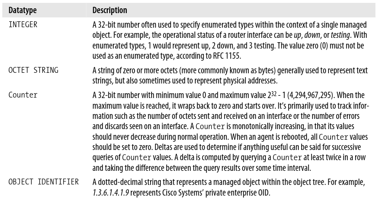

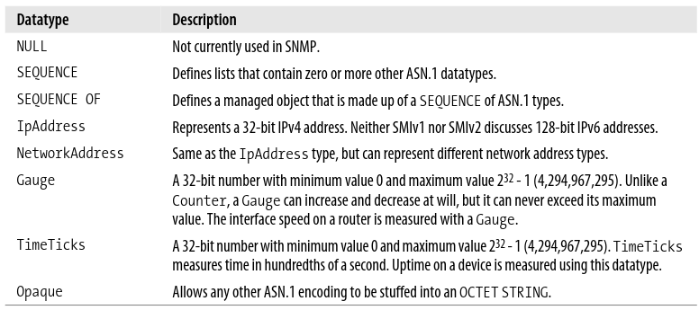

The goal of all these object types is to define managed objects. The MIB can be thought of as a specification that defines the managed objects a vendor or device supports. Vendor-specific MIBs are typically distributed as human-readable text files that can be inspected (or even modified) with a standard text.

The first defines the name of the MIB. The IMPORTS section of the MIB is sometimes referred to as the linkage section. It allows you to import datatypes and OIDs from other MIB files using the IMPORTS clause.

Each group of items imported using the IMPORTS clause uses a FROM clause to define the MIB file from which the objects are taken. The OIDs that will be used throughout the remainder of the MIB follow the linkage section. 

After the OIDs are defined, we get to the actual object definitions. Every object definition has the following format:

    <name> OBJECT-TYPE
        SYNTAX <datatype>
        ACCESS <either read-only, read-write, write-only, or not-accessible>
        STATUS <either mandatory, optional, or obsolete>
        DESCRIPTION
            "Textual description describing this particular managed object."
        ::= { <Unique OID that defines this object> }

A sequence is simply a list of columnar objects and their SMI datatypes, which defines a conceptual table.

## Extensions to the SMI in Version 2

SMIv2 extends the SMI object tree by adding the snmpV2 branch to the internet subtree, adding several new datatypes and making a number of other changes.

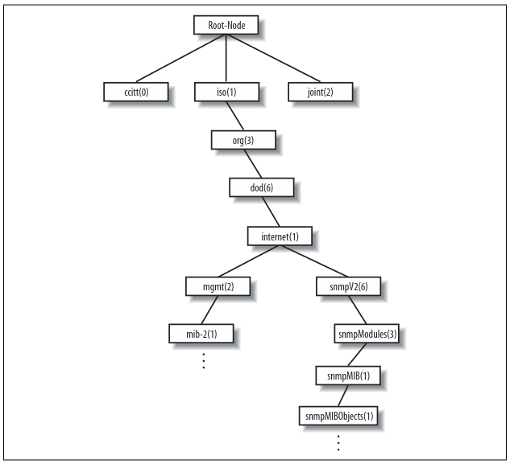

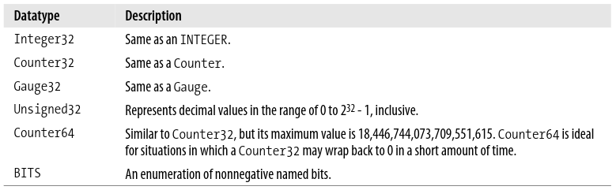

The definition of an object in SMIv2 has changed slightly from SMIv1. There are some new optional fields, giving you more control over how an object is accessed, allowing you to augment a table by adding more columns, and letting you give better descriptions. Here’s the syntax of an object definition for SMIv2. The changed parts are in ** **:

    <name> OBJECT-TYPE
        SYNTAX <datatype>
        **UnitsParts <Optional, see below>
        MAX-ACCESS <See below>
        STATUS <See below>**
        DESCRIPTION
            "Textual description describing this particular managed object."
        **AUGMENTS { <name of table> }**
        ::= { <Unique OID that defines this object> }

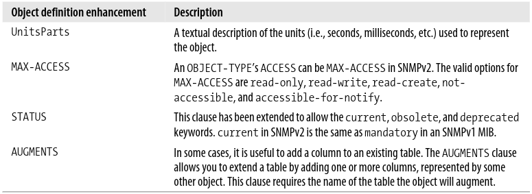

SMIv2 also introduces new textual conventions that allow managed objects to be created in more abstract ways.

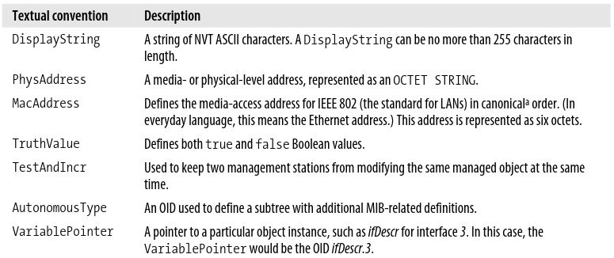

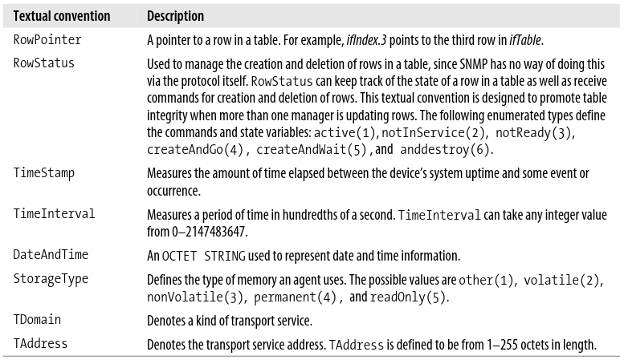

## SNMP Operations

The Protocol Data Unit (PDU) is the message format that managers and agents use to send and receive information. Each of the following SNMP operations has a standard PDU format:
- get
- getnext
- getbulk (SNMPv2 and SNMPv3)
- set
- getresponse
- trap
- notification (SNMPv2 and SNMPv3)
- inform (SNMPv2 and SNMPv3)
- report (SNMPv2 and SNMPv3)

### The get Operation

The get request is initiated by the NMS, which sends the request to the agent. The agent receives the request and processes it to the best of its ability. Some devices that are under heavy load, such as routers, may not be able to respond to the request and will have to drop it. If the agent is successful in gathering the requested information, it sends a getresponse back to the NMS, where it is processed.

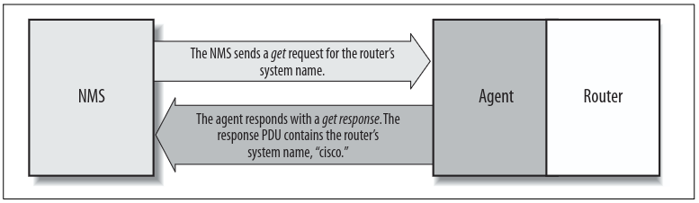

One of the items in the get request is a variable binding. A variable binding, or varbind, is a  ist of MIB objects that allows a request’s recipient to see what the originator wants to know. Variable bindings can be thought of as OID=value pairs that make it easy for the originator (the NMS, in this case) to pick out the information it needs when the recipient fills the request and sends back a response.

The get command is useful for retrieving a single MIB object at a time. Trying to manage anything in this manner can be a waste of time, though. This is where the getnext command comes in. It allows you to retrieve more than one object from a device, over a period of time.

### The getnext Operation

The getnext operation lets you issue a sequence of commands to retrieve a group of values from a MIB. In other words, for each MIB object we want to retrieve, a separate getnext request and getresponse are generated. The getnext command traverses a subtree in lexicographic order. Since an OID is a sequence of integers, it’s easy for an agent to start at the root of its SMI object tree and work its way down until it finds the OID it is looking for. This form of searching is called depth-first. When the NMS receives a response from the agent for the getnext command it just issued, it issues another getnext command. It keeps doing this until the agent returns an error, signifying that the end of the MIB has been reached and there are no more objects left to get.

### The getbulk Operation