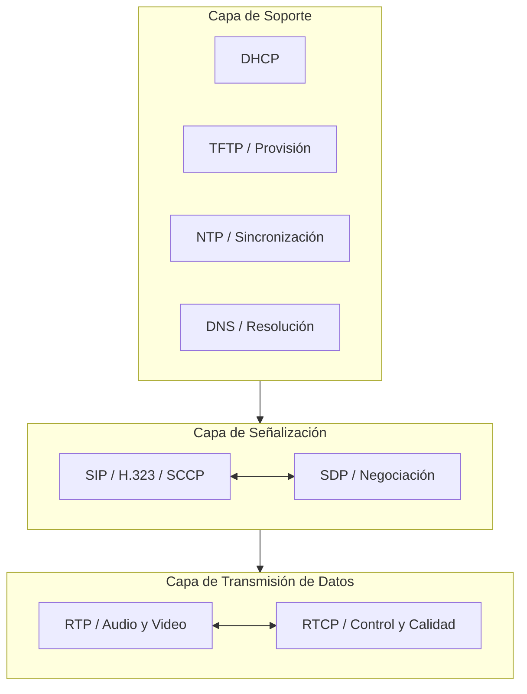
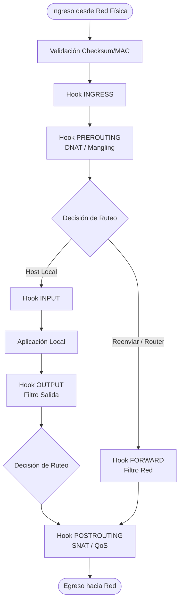

# Resumen Segundo Parcial AyGR

---

## Módulo 1: VoIP (Voz sobre IP)

La **Voz sobre IP (VoIP)** es un conjunto de protocolos y tecnologías que permiten transmitir voz o video a través de redes basadas en el protocolo IP. En lugar de usar la red telefónica tradicional, las comunicaciones de voz se digitalizan, se dividen en paquetes de datos y se envían por la red.

Para que esto funcione correctamente, deben resolverse tres cuestiones principales:
1. **Digitalización:** Cómo digitalizar la multimedia (proceso de digitalización).
2. **Paquetización:** Cómo transmitirla por la red (paquetización).
3. **Señalización:** Cómo establecer los canales de comunicación entre los dispositivos, considerando además que pueden tener diferentes capacidades.

### 1.1. ¿Por qué VoIP?
VoIP ofrece numerosas ventajas frente a la telefonía tradicional. Dependiendo de la arquitectura utilizada, proporciona:
* **Mayor versatilidad:** Mejor control de las funcionalidades de comunicación.
* **Reducción de costos:** Sus costos son menores y simplifica el diseño de red.
* **Infraestructura unificada:** Permite reutilizar la infraestructura existente, ya que todos los datos (voz, video y otros servicios) pueden viajar por el mismo cable de red sin requerir un cableado telefónico adicional.
* **Flexibilidad:** El sistema cuenta con hardware dedicado para terminales (teléfonos VoIP) y por software (*softphones*).
* **Administración simplificada:** Facilita la administración y la contabilidad, y no requiere personal especializado.
* **Fácil escalabilidad:** Se adapta fácilmente a cambios o a la incorporación de nuevos teléfonos, sin necesidad de recablear la red.

### 1.2. PBX (Central Telefónica)
Un **PBX (Private Branch Exchange)** es un dispositivo que proporciona enrutamiento de llamadas centralizado y aplicaciones de telefonía para un grupo de teléfonos empresariales.
* Las centrales telefónicas (PBX) pueden ser propietarias o basadas en software libre. Estas poseen una cantidad de internos y funcionalidades definidas. Su configuración requiere conocimientos técnicos, ya que su documentación no siempre es accesible.
* El **dialplan** es el conjunto de reglas que rige el comportamiento de enrutamiento de llamadas de la PBX y es el centro de comando del sistema Asterisk. Cuando un usuario marca un número, el sistema busca en el dialplan la acción a realizar: llamar a un interno, redirigir la llamada, reproducir un audio o ejecutar un script.

#### Terminales (Endpoints): Teléfonos Físicos y Softphones
Los internos pueden implementarse como:
* **Softphones (Terminales de Software):** Son aplicaciones telefónicas que se ejecutan en una computadora portátil o dispositivo móvil. Representan una ventaja económica porque pueden ser menos costosos y más fáciles de administrar que las unidades físicas. Un *softphone* funciona siempre y cuando el usuario tenga acceso a Internet.
* **Teléfonos IP Físicos (Hardphones):** Estos terminales son compatibles con TCP/IP y se conectan directamente a la red de datos, típicamente a través de una conexión Ethernet RJ45. Internamente, un teléfono IP es una aplicación de software que "habla" protocolos VoIP como SIP, SCCP o H.323.

---

### 1.3. ¿Cómo funciona VoIP?
La comunicación de Voz sobre IP funciona mediante la conversión de la voz analógica en datos digitales que se transmiten a través de redes IP. El proceso de comunicación en VoIP se divide en dos etapas principales:
1. **Señalización:** Se encarga de establecer, mantener y finalizar la comunicación. Define cómo se transportará y codificará la voz, así como los parámetros de la sesión.
2. **Transmisión de Datos:** Corresponde al envío de la información de voz en tiempo real.

#### Arquitectura de un sistema VoIP
La arquitectura de VoIP se compone de tres capas principales:



#### A) Capa de Señalización (SIP, H.323, etc.)
En esta capa se realiza lo siguiente:
* **Localización:** Los *endpoints* (teléfonos o *softphones*) deben registrarse con el servidor de registros para que este sepa qué nodos requieren servicio. Este proceso se realiza mediante mensajes específicos (como el método `REGISTER` en SIP). Una vez registrado, la dirección IP y la dirección MAC del teléfono se vinculan a un número de teléfono o alias. El servidor de registro acepta el mensaje `REGISTER` y actualiza la ubicación del usuario.
* **Establecimiento de llamadas (*call setup*):** En SIP, el método `INVITE` se utiliza para iniciar la llamada. Durante esta fase, se informa a los *endpoints* sobre el progreso de la llamada mediante mensajes de respuesta provisorios (Respuestas 1xx, como `100 Trying` o `180 Ringing`). Una vez que el destinatario contesta, se envía un mensaje de conexión (en SIP, `200 OK`).
* **Características de la sesión:** Se define cómo se transportará y codificará la voz. Los protocolos de señalización manejan la negociación de los parámetros de la conexión multimedia. El protocolo **SDP (Session Description Protocol)** se utiliza con SIP para describir el contenido multimedia (audio, video). El SDP negocia los códecs a utilizar, la velocidad de muestreo, el tamaño de *frame* y los números de puerto UDP que se usarán para la transmisión de medios (RTP).
* **Terminación de llamada:** El protocolo de señalización se utiliza para finalizar (colgar) la comunicación de manera controlada. En SIP, esto se logra con el método `BYE`.

#### B) Capa de Transmisión de Datos (RTP y RTCP)
Esta capa se compone de:
* **Encapsulamiento de datos de audio (y video):** Los datos de voz se generan mediante un códec (codificador-decodificador). El códec convierte la señal analógica a digital (muestreo) y, a menudo, comprime los datos. La voz muestreada se coloca dentro de un paquete RTP, que a su vez se encapsula en un encabezado UDP (User Datagram Protocol). Se utiliza UDP porque es un protocolo ideal para datos en tiempo real donde la retransmisión de paquetes perdidos o retrasados resultaría en una degradación del rendimiento o la usabilidad (latencia y jitter).
* **Secuenciamiento, Marcas de tiempo, Identificación:** RTP incluye campos en su encabezado cruciales para reconstruir la conversación en el receptor:
  * *Número de Secuencia:* Permite detectar paquetes perdidos y reordenar el flujo.
  * *Marca de Tiempo (Timestamp):* Para manejar el jitter y asegurar la sincronización en la reproducción.
  * *Tipo de Carga Útil (Payload Type):* Indica el códec utilizado.
  * *Identificador de Fuente de Sincronización (SSRC):* Permite al receptor recolectar todos los paquetes del mismo flujo.

#### C) Capa de Soporte (DHCP, NTP, FTP, etc.)
Gestionan servicios esenciales de red que, aunque no son específicos de VoIP, son vitales para su operación:
* **Autoconfiguración:**
  * **DHCP:** Además de asignar la dirección IP y la puerta de enlace, DHCP puede proporcionar la dirección del servidor TFTP y, a veces, la del servidor de llamadas.
  * **TFTP (Trivial File Transfer Protocol):** Para la provisión de configuración y de agenda telefónica global. Se utiliza para almacenar actualizaciones de firmware y archivos de configuración para los teléfonos IP.
* **Calidad de Servicio (QoS):**
  * La VoIP es sensible a la latencia, el jitter y la pérdida de paquetes.
  * El protocolo **NTP (Network Time Protocol)** es necesario para sincronizar los relojes de la red, lo que es vital para la contabilidad y la gestión de la calidad.
* **Autenticación, Autorización y Contabilidad (AAA):**
  * *Autenticación y Autorización:* Las PBX deben realizar el control de admisión y la autenticación. La autenticación puede realizarse durante el registro utilizando credenciales. Para asegurar el tráfico de señalización, se puede usar **Secure SIP (SIPS)**, que utiliza TLS (Transport Layer Security) y el puerto 5061. Para proteger el flujo de voz (RTP), se utiliza **Secure RTP (SRTP)**, que proporciona cifrado.
  * *Contabilidad:* Los protocolos de señalización registran eventos clave de la llamada. Esto incluye el número marcado, la hora de marcado, la hora de conexión, la duración y la hora de desconexión. Estos registros son cruciales para el proceso de facturación.
* **Uso de mnemónicos para apuntar servidores:**
  * **DNS:** Se utiliza para la resolución de nombres. En VoIP, la resolución traduce identificadores de recursos, como SIP URIs, en identificadores de capa de red (direcciones IP y números de puerto) para que los *endpoints* puedan comunicarse.

---

### 1.4. Protocolos de Señalización
Existen diferentes protocolos que se pueden usar para la señalización. Estos a su vez son los que definen cómo funcionará la comunicación y el resto de los protocolos y tecnologías a utilizar.

#### El Protocolo SIP
**SIP (Session Initiation Protocol)**, definido en el **RFC 3261**, es un protocolo similar al protocolo HTTP, escrito en texto plano, de tipo petición/respuesta, que opera comúnmente sobre el puerto TCP/UDP 5060.
* Un mensaje SIP es un requerimiento de un cliente a un servidor o una respuesta de un servidor a un cliente.
* Involucra interacciones del tipo **User Agent Client (UAC) $\leftrightarrow$ User Agent Server (UAS)**.
* SIP opera en la capa de aplicación y fue diseñado con la premisa de la simplicidad; se utiliza para iniciar, modificar y finalizar sesiones multimedia.

##### Componentes:
* **User Agent (UA):** Terminal o Teléfono que inicia o responde a las transacciones SIP. Es *stateful* (mantiene el estado de la sesión).
* **Registrar Server:** Servidor de registro de cuentas. Los teléfonos se registran cuando se enciende un teléfono físico o se inicia un *softphone*; se envía un mensaje del protocolo SIP para decir al servidor de registro "¡acá estoy!". El servidor de registro responde periódicamente para saber si siguen conectados. Su función es llevar la relación entre el número de teléfono y la dirección IP actual. Puede requerir autenticación.
* **Proxy Server:** Servidor que reenvía mensajes, actuando como intermediario entre cliente y servidor bajo el protocolo SIP. Se usa para enrutamiento y para aplicar políticas como la autenticación.
* **Redirect Server:** Servidor que redirige mensajes a un conjunto alternativo de URIs.

##### Direccionamiento en nomenclatura URI (RFC 3261):
Puede ser un dominio mnemónico o una dirección IP. El puerto puede ir o no (el puerto bien conocido para SIP es el 5060).
* `sip:user@domain:port` (ej. `sip:ale@sip.unlu.edu.ar:5060`)
* `sip:user@host:port` (ej. `sip:mauro@10.100.20.2:5060`)
* `sip:phone_number@domain` (ej. `sip:1590@servmarce.unlu.edu.ar`)

##### Peticiones (Métodos):
La estructura de una petición sigue el formato: `Method <SP> Request-URI <SP> SIP-Version <CRLF>`.
* **REGISTER:** Registra la información de contacto y la ubicación del *endpoint* en el servidor de registro.
* **INVITE:** Utilizado para el establecimiento de sesiones. Invita a un usuario a una llamada e inicia la sesión.
* **ACK:** Confirma que el cliente ha recibido una respuesta final a un `INVITE`.
* **CANCEL:** Cancela una llamada que está pendiente pero que aún no se ha conectado.
* **BYE:** Termina una conexión o sesión. Puede ser enviado por cualquiera de las partes.
* **OPTIONS:** Utilizado para consultar a los servidores por sus capacidades; devuelve los métodos que soporta.

##### Respuestas:
La estructura sigue el formato: `SIP-Version SP Status-Code SP Reason-Phrase CRLF`.
* **1xx (Provisionales):** Indica que la petición fue recibida y se sigue procesando.
* **2xx (Success):** La acción fue recibida, entendida y aceptada exitosamente.
* **3xx (Redirection):** Se requiere una acción adicional para completar la petición.
* **4xx (Client Error):** La petición tiene sintaxis incorrecta o no puede ser cumplida en este servidor.
* **5xx (Server Error):** El servidor falló al cumplir una petición aparentemente válida.
* **6xx (Global Failure):** La petición no puede ser cumplida en ningún servidor.

##### Estructura de Mensajes:
1. Línea inicial (*start-line*).
2. Uno o más campos de encabezados (*header fields*).
3. Una línea en blanco que indica la finalización de los encabezados.
4. Opcionalmente un cuerpo de mensaje (*message-body*).

##### Encabezados mínimos en un Request:
* **Request-URI:** Es un URI SIP o SIPS que indica el usuario o servicio al cual se destina la solicitud. Formato: `sip:user@server:port`.
* **SIP-Version:** Especifica la versión utilizada (ej. `"SIP/2.0"`).
* **To:** Especifica el destinatario de la solicitud en formato URI. (ej. `To: Carol <sip:carol@chicago.com>`).
* **From:** Indica la identidad del iniciador de la solicitud en formato URI, incluyendo una etiqueta (*tag*) que ayuda a especificar el diálogo. (ej. `From: "Bob" <sips:bob@biloxi.com> ;tag=a48s`).
* **Cseq (Command Sequence):** Valor numérico con el método que ayuda a identificar y ordenar transacciones dentro de un diálogo. (ej. `CSeq: 4711 INVITE`).
* **Call-Id:** Valor único que agrupa todos los mensajes (solicitudes y respuestas) que pertenecen a un mismo diálogo o sesión. (ej. `Call-ID: f81d4fae-7dec-11d0-a765-00a0c91e6bf6@foo.bar.com`).
* **Max-Forwards:** Limita el número de saltos (*hops*) que un mensaje puede recorrer. El valor recomendado es 70. (ej. `Max-Forwards: 70`).
* **Via:** Indica a los nodos involucrados dónde enviar la respuesta SIP. Debe comenzar con `SIP/2.0` y debe incluir el parámetro *branch* que empieza con `z9hG4bk`. (ej. `Via: SIP/2.0/UDP pc33.atlanta.com;branch=z9hG4bK776asdhds`).
* **Contact:** Debe estar presente en la solicitud `INVITE` (y `REGISTER`). Contiene una única URI que representa la ubicación actual del *endpoint*. (ej. `<sip:bob@192.0.2.4>`).

> [!NOTE]
> **Coincidencia en Registro:** En los mensajes `REGISTER` los encabezados `To` y `From` son iguales.

---

### 1.5. Escenario Típico de Inicio (Startup) de un Teléfono VoIP
¿Qué intercambio de mensajes se produce al encender un teléfono IP conectado a una red?
1. **DHCP (Dynamic Host Configuration Protocol):** El teléfono IP se enciende y contacta a un servidor DHCP para obtener una dirección IP, una máscara de subred, la puerta de enlace predeterminada (*default gateway*) y las direcciones de los servidores TFTP y del servidor de llamadas (*Call Server / Gatekeeper*).
2. **TFTP (Trivial File Transfer Protocol):** Una vez que el teléfono obtiene las direcciones necesarias, contacta al servidor TFTP. El servidor TFTP se utiliza para actualizar el firmware del teléfono y, a veces, para descargar un archivo de configuración que puede contener parámetros operativos (como la dirección del *Call Server*, el idioma o la disposición de los botones).
3. **Señalización Específica de VoIP (Registro):** Después de DHCP y TFTP, el teléfono procede con la mensajería específica del protocolo VoIP para registrarse. En el caso de SIP, el teléfono envía un mensaje `REGISTER` al servidor de llamadas (*Registrar Server*) para informar de su ubicación (IP y URI) y para que el servidor entienda que el nodo requiere servicio.

---

### 1.6. Flujos de Datos en una Llamada Completa
Existen dos flujos o categorías de protocolos principales en una llamada VoIP que representan la separación del tráfico de control y el tráfico de medios:
1. **Flujo de Señalización (SIP):** Es el tráfico de control, usado para establecer y terminar la comunicación.
   * Este tráfico es corto e intermitente y típicamente se transporta sobre UDP o TCP en el puerto 5060.
   * Los mensajes SIP fluyen generalmente entre el teléfono y el servidor de llamadas (*Proxy* o *Registrar*).
2. **Flujo de Transmisión de Medios (RTP/RTCP):** Es el tráfico de datos de voz o video, utilizado una vez que la llamada ha sido establecida.
   * Este tráfico es consistente y prolongado y se transporta casi siempre sobre UDP.
   * Una vez establecida la llamada, los paquetes RTP suelen fluir directamente entre los dos teléfonos (*endpoints*), lo que se conoce como **ruta de llamada independiente**. Sin embargo, existen excepciones donde el servidor de llamadas permanece en la ruta del tráfico de voz.

#### Uso de SDP en la Señalización
* **¿Cuáles mensajes tienen SDP?** El mensaje SIP que inicia la negociación de capacidades es el `INVITE`. El SDP se envía como texto *payload* dentro del cuerpo del mensaje `INVITE`. El mensaje SIP que confirma la negociación y establece los parámetros finales es el `200 OK` de la respuesta al `INVITE`. El `200 OK` del *endpoint* receptor también incluye una carga SDP.
* **¿Cómo podría ser aprovechado para clasificación por inspección profunda SDP?** El SDP se utiliza para describir el contenido multimedia que se transferirá, incluyendo el códec a utilizar, la duración y el puerto UDP que se usará para el flujo de medios RTP. La inspección profunda de paquetes de la carga SDP puede ser aprovechada por dispositivos de red para configuración de QoS ya que el SDP especifica los parámetros del flujo RTP (protocolo y puerto UDP). Los routers pueden clasificar el tráfico que coincida con esos puertos como tráfico de voz y priorizarlo.

#### Métodos Involucrados en el Establecimiento:
* **Invite:** El mensaje `INVITE` es el método utilizado para iniciar la sesión, actuando como una invitación a otro SIP *endpoint* para participar en una llamada. Contiene la información necesaria para el enrutamiento (encabezados `Via`, `From`, `To`, `Call-ID`, `CSeq`, `Max-Forwards`) y transporta el SDP en su cuerpo para anunciar las capacidades del *endpoint* que llama.
* **Trying (100 Trying):** Respuesta provisional. Conserva los *headers*, indica que la petición `INVITE` fue recibida y se está procesando. Su función principal es evitar la retransmisión del mensaje `INVITE` por parte del *User Agent* que lo originó, ya que detiene el temporizador de retransmisión.
* **Ringing (180 Ringing):** Respuesta provisional. Conserva los *headers*, indica que el *endpoint* destino está siendo notificado de la solicitud entrante (está timbrando). Esta respuesta informa al emisor que el proceso de notificación al usuario final ha comenzado.
* **200 OK:** Es la respuesta estándar que indica éxito. Cuando se envía en respuesta a un `INVITE`, indica que el destinatario ha aceptado la llamada. La recepción de esta respuesta por el *endpoint* que llamó dispara la respuesta final `ACK`.
* **ACK:** Es el último mensaje de señalización antes de que comience el flujo de medios RTP. Confirma que el cliente recibió la respuesta `200 OK`.

#### Intercambio Típico en la Tríada UAC $\rightarrow$ Servidor Proxy $\rightarrow$ UAS:
1. `INVITE` (UAC $\rightarrow$ Proxy $\rightarrow$ UAS): El UAC solicita iniciar una sesión con el destinatario.
2. `100 Trying` (Proxy $\rightarrow$ UAC): El servidor proxy avisa que recibió el `INVITE` y detiene las retransmisiones.
3. `180 Ringing` (UAS $\rightarrow$ Proxy $\rightarrow$ UAC): El destino notifica que el teléfono está sonando.
4. `200 OK` (UAS $\rightarrow$ Proxy $\rightarrow$ UAC): El usuario destino atiende la llamada.
5. `ACK` (UAC $\rightarrow$ Proxy $\rightarrow$ UAS): Confirmación de recepción del `200 OK`.
6. **Flujo de Medios (RTP):** Comienza la transmisión de audio/video de extremo a extremo.

---

### 1.7. El Protocolo SDP (Session Description Protocol)
Es un protocolo que viaja encapsulado dentro de los mensajes SIP. Su objetivo es transmitir información acerca de los flujos en sesiones multimedia para permitir a los destinatarios participar en la sesión.

#### Una descripción de sesión SDP incluye:
* **Session Description (Descripción de Sesión):** Nombre de sesión y propósito.
* **Time Description (Descripción Temporal):** Tiempo(s) en que la sesión es activa.
* **Media Description (Descripción de Medios):** Los medios que componen la sesión (audio, video) e información para recibir esos medios (direcciones IP, puertos, formatos).

#### Media Information:
* El tipo de contenido (video, audio, etc.).
* El protocolo de transporte (RTP/UDP/IP, H.320, etc.).
* El formato del contenido (H.261 video, MPEG video, etc.).
* Direcciones y puertos (Unicast o multicast).

#### Campos de SDP en una Captura (Identificados con una sola letra):
* `v=`: Versión del protocolo.
* `o=`: Identificador del origen de la sesión (dueño, ID de sesión, versión, red, dirección IP). Nombra de manera única la solicitud.
* `s=`: Nombre de la sesión (nombre significativo para el intercambio).
* `c=`: Información de la conexión. Especifica la dirección IP que se debe utilizar para el canal de medios.
* `t=`: Tiempos de la sesión (tiempo de inicio y de parada).
* `m=`: Medios y códecs disponibles. Indica el tipo de medio (audio/video), puerto de escucha, protocolo de transporte y los identificadores de formato de carga útil (códecs). Si se soportan múltiples códecs, se listan en orden de preferencia.
* `a=`: Atributos de la sesión o del medio. Mapea un número con un códec, indica el identificador de perfil RTP, el códec y la tasa de muestreo que se utilizarán para el canal de medios (ej. `rtpmap:0 PCMU/8000`).

---

### 1.8. ¿Qué es un CODEC?
Un códec es un algoritmo, abreviatura de **codificador-decodificador** (*coder-decoder*). Su propósito es convertir la señal de voz analógica en una serie de muestras digitales en la fuente (emisor), y luego volver a convertirla a analógica en el receptor.

#### Proceso Completo desde el Micrófono hasta el Paquete RTP
1. **Captura Analógica (El Micrófono):** El sonido es capturado por el micrófono como una onda de sonido analógica. Esta señal tiene tres características principales: frecuencia (ciclos por segundo), amplitud (fuerza) y fase. Los valores posibles de tiempo y amplitud son infinitos (continuos). El micrófono capta las vibraciones en el aire y genera esta salida analógica.
2. **Conversión de Analógico a Digital (Códec):** Para que la voz se pueda transmitir sobre redes de paquetes IP, debe convertirse a digital mediante un códec. Este proceso utiliza la **Modulación por Codificación de Pulsos (PCM)** a través de dos subprocesos:
   * **Muestreo:** Evaluación de la amplitud de la señal analógica en intervalos de tiempo determinados.
   * **Cuantificación:** Asignación de un valor binario discreto al valor medido en el muestreo, aproximándolo al nivel más cercano de una escala graduada. El resultado es un conjunto de muestras discretas tomadas con una frecuencia determinada.
3. **Paquetización y Transporte (RTP):** Una vez que la voz ha sido codificada, se divide en partes iguales para su transporte en tiempo real:
   * *Encapsulación en RTP:* La voz codificada se coloca dentro de la carga útil del paquete RTP.
   * *Encapsulación en UDP:* El paquete RTP a su vez se encapsula en una cabecera UDP, y luego en IP.

#### Factores que determinan la calidad y ancho de banda:
* **La resolución:** Cantidad de "bits" que se utilizan por muestra para representar la amplitud. Más bits por muestra permiten una mejor resolución. Para cada muestra se asigna un valor basado en **8 bits**, que proporcionan 256 valores posibles de resolución.
* **La Frecuencia de Muestreo (medida en Hz):** Cantidad de mediciones que se toman por segundo. Cuanto mayor sea el número de muestras tomadas, mayor será la fidelidad de la representación de la señal original.
  * *Teorema de Nyquist:* Para reproducir con precisión una señal analógica en formato digital, la tasa de muestreo debe ser mayor o igual a dos veces el ancho de banda máximo de la señal original.
  * *Aplicación en Telefonía:* Dado que el canal de voz telefónica asignado es de hasta 4000 Hz, la frecuencia de muestreo estándar debe ser de **8000 Hz** ($2 \times 4000\text{ Hz}$) para dar cuenta de todas las variaciones de la frecuencia audible en la voz. Si la frecuencia de muestreo es demasiado baja, se pierden detalles esenciales de la señal original.

---

### 1.9. División en Paquetes y Balance (*Framing*)
El *framing* o *packetization* es el proceso de dividir el flujo de información digital en bloques de tamaño igual a $N$ bits o $N$ milisegundos para su transporte a través del protocolo RTP.
* **Packet rate (Tasa de paquetes):** Cantidad de paquetes que se envían por unidad de tiempo.
* **Balance entre el tamaño de los paquetes:** El proceso de paquetización requiere equilibrar la latencia con la sobrecarga de cabeceras y la resiliencia a pérdidas:
  * **¿Pocos paquetes de muchos bits?** Reducen la sobrecarga de red (se envían menos encabezados en total), pero agregan retraso (*lag / packetization delay*) porque el paquete debe esperar en el emisor hasta acumular suficiente audio para llenarse. Si se pierde un paquete, la pérdida de información es grande, provocando vacíos de audio notorios.
  * **¿Muchos paquetes de pocos bits?** Mejoran el *delay* y la pérdida de paquetes individuales es poco perceptible, pero requieren una gran sobrecarga de red debido a que los encabezados IP, UDP y RTP deben transmitirse con mayor frecuencia.

> [!NOTE]
> Se necesitan más de 10,000 llamadas de voz concurrentes para saturar un canal de gran capacidad, por lo que el ancho de banda individual no influye demasiado en la tasa de transferencia general, pero la sobrecarga acumulada de encabezados sí influye drásticamente en la aplicación de políticas de QoS.

---

#### Transcodificación
Ocurre cuando dos dispositivos en una llamada no soportan el mismo códec. En este caso, el flujo de audio debe pasar obligatoriamente por el servidor de registro o pasarela multimedia, el cual debe decodificar la señal recibida y volver a codificarla utilizando el formato del destinatario. Este proceso consume una cantidad significativa de recursos de procesamiento (CPU) del servidor.

---

### 1.11. El Protocolo RTP (Real-Time Transport Protocol)
RTP proporciona servicios de entrega de extremo a extremo para datos con características de tiempo real, como audio y video interactivo. Utiliza UDP como protocolo de transporte subyacente.

#### Campos del Encabezado RTP:
* **V (Versión):** Indica la versión del protocolo (el valor actual es 2).
* **P (Padding / Relleno):** Si está activo, indica que el paquete contiene octetos de relleno adicionales al final de la carga útil que no pertenecen a los datos de audio.
* **X (Extensión):** Indica si el encabezado fijo está seguido por una cabecera de extensión.
* **CC (CSRC Counter / Conteo de Fuentes Contribuyentes):** Cantidad de identificadores CSRC que siguen al encabezado fijo (usado en escenarios de conferencia telefónica).
* **M (Marker / Marcador):** Permite marcar eventos importantes del flujo, como el inicio de una ráfaga de voz (*talkspurt*) tras un período de silencio.
* **PT (Payload Type / Tipo de Carga Útil):** Identifica el códec utilizado para la digitalización de la voz contenida en el paquete.
* **Número de Secuencia:** Se incrementa en uno con cada paquete RTP transmitido, ayudando al receptor a detectar paquetes perdidos y a reordenar los que lleguen fuera de secuencia.
* **Marca de Tiempo (Timestamp):** Representa el instante temporal en que se tomó la primera muestra del paquete de audio. Permite calcular la variación del retraso (jitter) y asegurar la sincronización en la reproducción de las muestras.
* **SSRC (Synchronization Source Identifier):** Identificador aleatorio único de 32 bits que agrupa los paquetes pertenecientes al mismo flujo de origen.
* **CSRC (Contributing Source Identifier):** Identifica las fuentes contribuyentes que se mezclaron en una sesión de conferencia multipunto.

---

### 1.12. El Protocolo RTCP (RTP Control Protocol)
RTCP se utiliza para monitorear la calidad del servicio e intercambiar información de control de manera periódica entre los participantes de una sesión de medios.
* Provee *feedback* sobre la calidad de la distribución de datos.
* Permite controlar codificaciones adaptables mediante el monitoreo de paquetes y bytes enviados y perdidos.
* Provee nombres canónicos (CNAME) para las fuentes para identificar de forma permanente a un participante (el SSRC puede cambiar si se reinicia la sesión).
* Todos los participantes envían paquetes RTCP. La tasa a la que se envían es calculada acorde a la cantidad de participantes para no saturar la red (usualmente limitada al 5% del ancho de banda total del flujo de medios).
* Opcionalmente puede conducir información mínima de control de sesión.
* Provee información sobre paquetes perdidos y recibidos para evaluar el estado de la red.

#### Tipos de Paquetes RTCP:
* **SR (Sender Report):** Contiene estadísticas de transmisión y recepción de los participantes que son emisores activos (ID de la fuente, timestamps NTP/RTP, número de paquetes enviados, bytes enviados).
* **RR (Receiver Report):** Contiene estadísticas de recepción de los participantes que no son emisores activos. Proporciona información vital sobre el estado de la red (ID del emisor, porcentaje de paquetes perdidos desde el último reporte, acumulado de paquetes perdidos, máximo número de secuencia recibido, jitter de llegada, último reporte de emisor SR recibido y el *delay* desde dicho SR).
* **SDES (Source Description):** Contiene descripciones detalladas de los emisores, permitiendo a los receptores conocer el CNAME del *endpoint*. Puede incluir el nombre del usuario, correo electrónico, número de teléfono y el nombre de la aplicación de telefonía utilizada.
* **BYE:** Indica el final de la participación en el flujo. Debe ser el último mensaje enviado con un SSRC o CSRC en particular.
* **APP:** Reservado para funciones específicas de la aplicación, destinado a usos y desarrollos experimentales.

---

### 1.13. Componentes de Software y Hardware en VoIP
* **Métrica de Calidad (MOS - Mean Opinion Score):** Promedio de calificaciones del 1 (muy mala) al 5 (excelente) otorgado por personas respecto a la calidad percibida de una llamada.
* **Software PBX (Servidores / Centrales):**
* **Software Clientes (Softphones):**
* **Hardware:**
  * *Teléfonos IP:* Endpoints con capacidad de red TCP/IP (con o sin cámara) que se conectan de manera directa.
  * *Placas de interfaz telefónica:* Tarjetas PCI/PCIe instaladas en los servidores SoftPBX para conectarse a la red telefónica analógica tradicional (PSTN / líneas FXO/FXS/E1).
  * *Equipos de VC:* Sistemas dedicados de videoconferencia.
  * *Central Telefónica IP:* PBX física propietaria.
  * *Power over Ethernet (PoE):* Posibilidad de aprovechar el mismo cable de datos UTP para alimentar eléctricamente los dispositivos (como Access Points y Teléfonos IP), simplificando el tendido.

---

### 1.14. El Protocolo H.323 (ITU-T)
Originalmente propuesto como una solución para videoconferencias en redes de área local (LAN), evolucionó hasta convertirse en un estándar completo de reemplazo de PBX.
* Se considera un conjunto de protocolos **complejo** debido a que se basa en la arquitectura y trasfondo de la telefonía tradicional digital (ISDN).
* **Subprotocolos de H.323:**
  * **H.225:** Utilizado para el registro, control de admisión (RAS) y señalización de llamadas.
  * **H.245:** Protocolo de control utilizado para la negociación de capacidades y apertura de canales de medios.
* **Componentes H.323:**
  * *Terminales (Endpoints)*.
  * *Gateways:* Pasarelas para traducción de protocolos y medios.
  * *Gatekeepers:* Componente central opcional que proporciona capacidades centralizadas de traducción de direcciones, monitorización, control de admisión y señalización de llamadas en una zona H.323.

---

### 1.15. Factores de Red que Afectan la VoIP
Dado que la voz es un tipo de dato en tiempo real sensible al tiempo, las características físicas de la red pueden degradar severamente el rendimiento y la experiencia del usuario:
* **Latencia (Latency / Delay):** El tiempo que tarda desde que el orador habla hasta que el oyente escucha lo dicho. Una latencia excesiva dificulta la fluidez de la conversación, causando que los participantes se interrumpan constantemente. El máximo de latencia aceptable de extremo a extremo para telefonía de calidad es de aproximadamente **150 ms**.
* **Jitter (Variación del Retardo):** Es la variación en los tiempos de llegada de los paquetes al receptor. El jitter suele ser causado por la congestión dinámica de los routers o sobrecargas en los procesadores de los *endpoints*. Si el jitter es muy alto, provoca voz entrecortada, distorsionada o confusa. Se mitiga implementando un búfer de jitter (*jitter buffer*) en el receptor, lo que añade una pequeña latencia fija para ordenar los paquetes.
* **Pérdida de Paquetes (Packet Loss):** Ocurre cuando los paquetes de voz se descartan en la red debido a congestión de colas o errores de transmisión. A diferencia del tráfico de archivos, en VoIP no se retransmiten los paquetes perdidos (ya que el audio llegaría demasiado tarde para ser útil). Los estándares recomiendan mantener la pérdida de paquetes **por debajo del 1%** para no degradar el servicio.
* **Otros Factores:**
  * *Eco:* Retorno de la propia voz del orador debido a problemas de acoplamiento acústico o interfaces híbridas (analógico/digital).
  * *NAT (Network Address Translation):* Interfiere gravemente con la VoIP porque los protocolos de señalización (SIP y H.323) incluyen la dirección IP privada del cliente dentro de la carga útil del mensaje de control, haciendo que el destinatario externo no sepa a dónde enviar las respuestas o el flujo RTP de retorno. Se requiere de técnicas adicionales (como STUN, TURN o Session Border Controllers) para solucionar esto.

---
---

## Módulo 2: Introducción a la Seguridad en Redes de Datos

La seguridad en redes de datos es un componente esencial para garantizar que la información de una organización se mantenga íntegra, disponible y confidencial. Dado que la información es uno de los activos más importantes de cualquier organización, su protección es fundamental para el cumplimiento de los objetivos, el desempeño y la subsistencia de la entidad.

La gestión de la seguridad busca proteger los recursos de información y la tecnología utilizada para su procesamiento frente a todo tipo de amenazas. Estas amenazas pueden ser internas o externas, deliberadas o accidentales, y su adecuada gestión asegura la continuidad de las actividades organizacionales.

### 2.1. ¿Qué debe protegerse?
La seguridad debe abarcar la información en todas sus formas de existencia, incluyendo información que se encuentra:
* Escrita o impresa en documentos físicos.
* Expuesta de manera verbal durante conversaciones o reuniones.
* Transmitida mediante correo tradicional.
* Almacenada en el conocimiento de las personas (como procedimientos, patentes o experiencias clave).

Estas formas de información requieren medidas de seguridad orientadas tanto a su almacenamiento seguro como a su circulación controlada dentro y fuera de la organización.

#### Ámbitos de la Seguridad:
* **Seguridad de la Información:** Incluye toda la información almacenada en dispositivos electrónicos o físicos, independientemente de si se encuentra conectada a una red.
* **Seguridad Informática:** Se centra en la información transmitida a través de medios electrónicos y aquella almacenada en nodos de una red de datos.
* **Seguridad en Redes de Datos:** Considera la protección de todos los servicios, medios y procesos que permiten acceder a la información dentro de una red. Esto abarca la transmisión de datos, los servidores y dispositivos de comunicación, así como cualquier infraestructura que facilite el acceso y procesamiento de la información.

---

### 2.2. Conceptos Clave de Seguridad
* **Activos:** Los elementos valiosos de la organización que requieren protección, incluyendo la información, el software, las redes y el hardware.
* **Amenazas:** Cualquier factor (humano, natural o técnico) que pueda comprometer la seguridad de la información. Las amenazas no siempre son maliciosas o intencionales; pueden surgir de fallas técnicas (fallo de hardware, corte de energía), desastres naturales (inundación de un data center) o errores humanos accidentales (borrado accidental de datos). Por ello, es imprescindible contar con mecanismos que permitan detectar alteraciones en la información, como los *checksums*, para asegurar su integridad.
* **Vulnerabilidades:** Debilidades o fallos presentes en los activos (como bugs de software, configuraciones inseguras o la ausencia de controles físicos). Para minimizar estos riesgos, es necesario gestionar adecuadamente el ciclo de vida de los dispositivos, incluyendo tareas de mantenimiento y actualización periódica de firmware.
  * Las vulnerabilidades de software se catalogan e identifican comúnmente a nivel global mediante sistemas como **CVE (Common Vulnerabilities and Exposures)**, que asigna descripciones detalladas y un identificador único a cada fallo para aplicar parches de forma eficiente.
* **Riesgo:** Representa la probabilidad o posibilidad de que una amenaza explote una vulnerabilidad sobre un activo y le cause daño.
* **Daño:** El resultado destructivo directo tras la materialización de una amenaza.
* **Impacto:** Medida que evalúa la gravedad y consecuencias organizacionales o financieras de ese daño.
* **Controles y Salvaguardas:** Cualquier mecanismo, procedimiento, técnica o aplicación que tenga como objetivo disminuir o eliminar vulnerabilidades, previniendo amenazas, detectándolas en tiempo real o facilitando la recuperación parcial o total del daño.
* **Análisis Forense y Recuperación:** Es un proceso fundamental en la gestión de incidentes de seguridad que investiga cómo ocurrió un incidente, determina el alcance del daño y recolecta evidencias para evitar que vuelva a suceder. Forma parte de un enfoque sistemático de tres etapas: proteger los activos, detectar amenazas y aplicar mecanismos de recuperación.

#### Equipos de Respuesta ante Incidentes:
* **CSIRT (Computer Security Incident Response Team):** Equipo responsable de analizar, evaluar y aplicar medidas correctivas rápidas ante incidentes de seguridad. Su labor incluye recolectar y compartir información, trabajando generalmente las 24 horas para garantizar la continuidad de las operaciones.
* **CERT (Computer Emergency Response Team):** Cumple funciones similares al CSIRT, enfocándose en la coordinación global y respuesta ante emergencias de seguridad informática.

---

### 2.3. La Tríada CIA (Confidencialidad, Integridad y Disponibilidad)
El objetivo principal de la seguridad de la información es preservar tres características fundamentales:
1. **Integridad:** Garantiza que la información no sea adulterada por terceros no autorizados y que los datos puedan recuperarse si se detecta algún problema. Esta característica asegura que el contenido permanezca completo y exacto, y solo pueda modificarse por personal autorizado. Cuando la integridad se ve comprometida, los datos aparecen manipulados, corruptos o incompletos, afectando la confiabilidad.
2. **Confidencialidad:** Asegura que solo las personas autorizadas tengan acceso a la información. Requiere la implementación de controles de acceso rigurosos y la prevención de fugas de datos. Su violación puede generar la divulgación irreversible de datos sensibles.
3. **Disponibilidad:** Garantiza que los usuarios autorizados tengan acceso continuo a la información, recursos y servicios asociados cuando lo requieran. Implica la configuración de mecanismos de tolerancia a fallas, redundancias y la firma de acuerdos de nivel de servicio (SLA) con proveedores. Su falta de disponibilidad puede surgir de fallas de hardware o ataques como la Denegación de Servicio (DoS).

#### Niveles de Impacto por Pérdida de Seguridad (Preservación de CIA):
* **Bajo:** La pérdida de confidencialidad, integridad o disponibilidad genera un efecto adverso limitado en las operaciones de la organización, sus activos o los individuos (daño menor o molestias operativas).
* **Moderado:** La pérdida causa un efecto adverso serio, afectando de manera significativa las operaciones, recursos o causando daños financieros o reputacionales importantes.
* **Alto:** La pérdida tiene un efecto adverso severo o catastrófico, comprometiendo gravemente la continuidad de la organización, causando pérdidas millonarias o afectando la integridad física de las personas.

---

### 2.4. Arquitectura de Seguridad OSI: Recomendación ITU-T X.800
Proporciona un marco conceptual para estructurar la protección de la información y sistemas de comunicación. Distingue tres conceptos principales:

#### A) Ataques a la Seguridad
Cualquier acción que comprometa la protección de la información. Se clasifican en:
* **Ataques Pasivos:** Se caracterizan por acceder a la información sin modificarla. Su objetivo es escuchar o monitorear las transmisiones.
  * Ejemplos: lectura no autorizada de datos, análisis del tráfico de red (*sniffing*).
  * Son muy difíciles de detectar porque no alteran el flujo de datos, por lo que la mejor defensa es la prevención (cifrado).
* **Ataques Activos:** Involucran la modificación de los datos, la generación de flujos falsos o la interrupción de servicios haciéndose pasar por usuarios autorizados.
  * Ejemplos: modificación de mensajes, suplantación de identidad (*spoofing*), repetición de paquetes (*replay*) y denegación de servicio (DoS).

> [!NOTE]
> **Intruso Pasivo vs. Intruso Activo:** El intruso pasivo accede a información sin modificarla, relacionándose con ataques de intercepción. El intruso activo altera archivos o bases de datos, reenvía tráfico interceptado o genera flujos de control falsos (modificación, interrupción o generación).

##### Clasificación de Ataques según el Servicio Afectado:
* **Intercepción:** Captura de datos por un tercero antes de llegar al destino. Afecta principalmente la **Confidencialidad**.
* **Modificación:** Alteración de la información interceptada antes de ser reenviada al destino. Afecta la **Integridad**.
* **Interrupción:** El recurso o canal de comunicación se destruye o se vuelve no disponible. Afecta la **Disponibilidad**.
* **Generación:** El atacante inserta objetos o datos falsos en el sistema haciéndose pasar por el origen legítimo. Afecta la **Autenticidad**.

#### B) Mecanismos de Seguridad
Dispositivos o procesos diseñados para detectar, prevenir o recuperar el sistema ante un ataque a la seguridad. Ejemplos comunes:
* **Cifrado (Criptografía):** Para proteger la confidencialidad.
* **Firma Digital:** Para garantizar autenticidad e integridad.
* **Control de Acceso:** Para restringir el ingreso de usuarios.

#### C) Servicios de Seguridad
Servicios de comunicación que mejoran la protección de los sistemas de procesamiento de datos frente a ataques, valiéndose de uno o más mecanismos de seguridad:
* **Autenticación:** Garantiza la identidad del emisor o usuario, asegurando que no sea falsa. Permite verificar que quien intenta acceder a un sistema es efectivamente quien dice ser.
* **No repudio:** Evita que el emisor o el receptor puedan negar haber enviado o recibido un mensaje. La firma digital es el mecanismo por excelencia para lograrlo.
* **Control de acceso:** Determina los permisos específicos de los usuarios para interactuar con los recursos (ej. lectura, escritura, ejecución), bloqueando accesos no autorizados.

##### Tres Pasos Fundamentales para Asegurar el Acceso:
1. **Identificación:** El usuario indica al sistema cuál es su cuenta o identidad (ej. ingresar un nombre de usuario).
2. **Autenticación o Verificación:** El usuario demuestra que realmente es el titular de esa cuenta mediante credenciales. Se basa en tres categorías de factores:
   * *Lo que se conoce:* Una contraseña o PIN.
   * *Lo que se posee:* Un token físico, tarjeta inteligente o llave criptográfica.
   * *Lo que se es:* Datos biométricos (huella dactilar, reconocimiento facial).
3. **Autorización:** El sistema comprueba si el usuario autenticado posee los permisos específicos para acceder a un recurso o ejecutar una acción determinada.

---

### 2.5. Estrategias y Principios de Diseño de Seguridad
* **Menor privilegio:** Cada actor (usuario, proceso o dispositivo) debe tener únicamente los permisos y accesos estrictamente necesarios para realizar sus tareas y nada más. Esto minimiza el riesgo de daños accidentales o maliciosos.
* **Defensa en profundidad:** Implementación de mecanismos de seguridad en múltiples niveles superpuestos (hardware, software, políticas y procedimientos físicos). Si un nivel de protección falla, otros continúan activos para mitigar la amenaza.
* **Seguridad desde el diseño (*Security by Design*):** La seguridad debe considerarse desde la concepción del sistema o software, no agregarse como una capa posterior. Esto asegura controles coherentes e integrados en todas las fases.
* **Cuello de botella:** Dirigir los flujos de tráfico a través de puntos de control centralizados y limitados donde sea fácil monitorear y aplicar reglas de seguridad de manera efectiva.
* **Punto más débil:** La seguridad de un sistema es tan fuerte como su punto más débil; es fundamental identificar y reforzar las áreas más vulnerables del entorno.
* **Fallar en forma segura (*Fail-safe defaults*):** En caso de fallo o error, todas las solicitudes o accesos deben denegarse por defecto, garantizando que un error de software o sistema no abra el acceso sin autorización.
* **Diversidad de defensa:** Utilizar tecnologías y herramientas de diferentes proveedores y arquitecturas. Si se descubre una vulnerabilidad crítica en un software específico, la diversidad evita que afecte a toda la infraestructura.
* **Simplicidad:** A mayor complejidad de un sistema, más difícil es garantizar su seguridad. Los diseños simples facilitan la verificación de reglas y la detección oportuna de fallos.
* **Transparencia:** Evitar depender de algoritmos o mecanismos secretos para mantener la seguridad. La protección debe basarse en la solidez del diseño y de las claves criptográficas, no en el desconocimiento del atacante.

---
---

## Módulo 3: Cortafuegos (Firewalls) e IDS/IPS

### 3.1. Cortafuegos / Firewall
Es un dispositivo o software que se ubica en el límite entre dos redes para observar el tráfico que circula y decidir, según reglas predefinidas, qué paquetes pueden pasar y cuáles no. Funciona como una barrera de protección controlando el flujo en ambas direcciones a través de listas de control de acceso (ACL) y analizando los encabezados o contenido de los paquetes.
* Filtran el tráfico entrante y saliente entre la red interna y redes externas (como Internet), previniendo intrusiones y fugas de información.
* Analizan encabezados, protocolos, puertos, IPs de origen y destino, y en ocasiones direcciones MAC o datos de la capa de aplicación, operando a distintos niveles de la pila OSI. Su ubicación habitual es en el router de borde.

#### Objetivos de Diseño de un Firewall:
1. Todo el tráfico de adentro hacia afuera de la red, y viceversa, debe pasar obligatoriamente a través del firewall (bloqueo físico/lógico alternativo).
2. Solo se permitirá el paso del tráfico autorizado según lo definido por la política de seguridad local.
3. El propio firewall debe ser inmune a intrusiones (sistema operativo seguro, parches al día y servicios mínimos activos).

#### Servicios que puede brindar:
* **Control de acceso:** Determina si autoriza o no el paso de un paquete basándose en la información que extrae de él.
* **Registro de actividades:** Registra todas las actividades (tráfico permitido y denegado) que lo atraviesan, sirviendo para auditorías, detección de intrusos e identificación de daños.
* **Extremo de NAT o de VPN:** Al ubicarse en el borde de la red, es el lugar ideal para realizar la traducción de direcciones (NAT) o actuar como concentrador de túneles VPN.

#### Políticas de Seguridad del Firewall ("Las 4 Ps"):
* **Paranoica:** Todo está prohibido, incluso aquello que normalmente debería permitirse. Máxima seguridad, pero muy difícil de operar.
* **Prudente:** Todo está prohibido, salvo aquello que se permita de manera explícita (política por defecto recomendada: *deny all*).
* **Permisiva:** Todo está permitido, salvo aquello que se prohíba explícitamente.
* **Promiscua:** Todo está permitido, incluso aquello que normalmente debería bloquearse. Nula seguridad.

---

### 3.2. Tipos de Firewall
* **Filtro de paquetes simple (Stateless Packet Filtering) - 1ª generación:** Revisa los paquetes de forma individual e independiente. Toma decisiones basándose en reglas estáticas sobre la interfaz de red, direcciones IP de origen/destino, protocolo de transporte (TCP/UDP/ICMP) y puertos. No recuerda si un paquete forma parte de una conversación abierta.
* **Filtro de paquetes con estado (Stateful Inspection Firewall) - 2ª generación:** Extiende el filtrado simple al mantener una tabla de estado de conexiones activas. Esto le permite asociar los paquetes con conexiones TCP o flujos UDP ya establecidos de forma legítima, facilitando la toma de decisiones precisas y segurando el tráfico de retorno de forma automática sin necesidad de reglas bidireccionales explícitas.
* **Filtro a nivel de aplicación (Application-Level Gateway o Proxy) - 3ª generación:** Actúa como intermediario completo (*proxy*) entre el cliente y el servidor para un protocolo de aplicación específico (ej. un proxy HTTP o FTP). Reconstruye la sesión completa a nivel de aplicación, analiza el contenido del mensaje y puede bloquear solicitudes basándose en el comportamiento del protocolo, cookies, URLs o comandos de aplicación específicos.
* **Gateway a nivel de circuito (Circuit-Level Gateway):** Autentica al cliente y, una vez establecida la conexión de control, actúa como intermediario a nivel de transporte (TCP/UDP) copiando los bytes del flujo hacia el destino sin examinar el contenido de la aplicación (ej. Proxy SOCKS).

#### Emplazamiento de los Firewalls:
* **Borde de la red:** Implementación habitual en los routers de entrada a la red corporativa.
* **Host-Based Firewall:** Software que se ejecuta en un servidor específico para protegerlo de accesos no autorizados a nivel local.
* **Personal Firewalls:** Software instalado en las estaciones de trabajo de los usuarios (ej. los firewalls integrados de los sistemas operativos).
* **WAF (Web Application Firewall):** Diseñado específicamente para proteger servidores web, filtrando mensajes HTTP y previniendo ataques a nivel de aplicación (como inyecciones SQL o Cross-Site Scripting).
* **Process Firewall:** Monitorea las llamadas a sistema realizadas por procesos específicos en un host, bloqueando acciones anómalas fuera del patrón esperado.

---

### 3.3. Emplazamiento Clásico y Topologías de Red
La topología clásica divide la red en tres zonas principales:

```
                    [ INTERNET (WAN) ]
                            |
                    [ Firewall Externo ]
                            |
                      +-----+-----+
                      |    DMZ    | (Servidores Públicos: Web, Mail, DNS)
                      +-----+-----+
                            |
                    [ Firewall Interno ]
                            |
                     [ RED LOCAL (LAN) ]
```

* **LAN (Local Area Network):** Red interna y privada de la organización donde se encuentran los usuarios y datos confidenciales.
* **DMZ (Zona Desmilitarizada):** Red intermedia aislada donde se ubican los servidores que ofrecen servicios a Internet (Servidor Web, Servidor de Correo, DNS). Debe ser accesible desde la WAN y, de forma muy controlada, desde la LAN.
* **WAN (Wide Area Network):** La red pública externa (Internet).

> [!IMPORTANT]
> **Esquema de Doble Firewall:** El tráfico de Internet debe pasar por el *Firewall Externo* para llegar a la DMZ. Si un atacante compromete un servidor en la DMZ, el *Firewall Interno* continúa bloqueando el acceso hacia la LAN. Si se utiliza un esquema de **un solo firewall** para controlar las tres zonas, el dispositivo actúa como único punto de falla; si se compromete, toda la red local queda expuesta.

---

### 3.4. Sistemas de Detección y Prevención de Intrusiones (IDS/IPS)

#### Sistema de Detección de Intrusiones (IDS)
El firewall tiene una capacidad limitada de análisis: filtra paquetes según reglas de encabezados pero no examina en profundidad el contenido. Para complementar esto, el **IDS** monitorea el tráfico de red o las actividades de un host con el fin de detectar comportamientos sospechosos o maliciosos, generando alertas. El IDS tiene un rol **pasivo**: no interrumpe el tráfico directamente, aunque puede interactuar con el firewall para aplicar reglas de bloqueo dinámicas tras detectar un ataque.

##### Modos de Detección en IDS:
* **Basado en patrones o firmas:** Compara el tráfico o archivos de registro con una base de datos de firmas conocidas de ataques (similar a un antivirus). Es altamente efectivo para ataques conocidos, pero inútil frente a ataques de día cero (*zero-day*) o variantes modificadas.
* **Basado en comportamiento o anomalías:** Analiza el tráfico habitual de la red para establecer una línea base de comportamiento normal. Si se detectan picos inusuales de tráfico, protocolos inesperados o tramas de tamaño anómalo, genera una alerta. Requiere un período de entrenamiento y calibración para evitar falsos positivos.

##### Factores evaluados por un IDS:
* Volumen de tráfico y variaciones abruptas.
* Tamaño promedio de los paquetes.
* Protocolos utilizados.
* Frecuencia y origen de las conexiones.
* Secuencias de comandos o patrones sospechosos en el flujo de datos.

#### Sistema de Prevención de Intrusiones (IPS)
A diferencia del IDS, el **IPS** adopta un rol **activo**. Se ubica "en el medio" del flujo de datos (*in-line*) y tiene la capacidad de bloquear o descartar de forma inmediata los paquetes maliciosos, cerrar conexiones TCP sospechosas o bloquear direcciones IP de origen.
* **HIPS (Host-Based IPS):** Se ejecuta en un servidor analizando los logs internos. Puede bloquear intentos de acceso tras detectar fallos repetidos (ej. Fail2ban, DenyHosts en servidores SSH o servidores de correo).
* **NIPS (Network-Based IPS):** Dispositivo de hardware dedicado que analiza el tráfico a nivel de red (ej. Suricata configurado en modo prevención).

---

### 3.5. SIEM y UTM

#### SIEM (Security Information and Event Management)
Es una solución de software centralizada que se encarga de recolectar, normalizar y analizar los registros o *logs* generados por todos los dispositivos, servidores y aplicaciones de la red. Su función es correlacionar eventos en tiempo real para identificar incidentes de seguridad complejos y facilitar el cumplimiento de normativas de auditoría.
* **SEM (Security Event Management):** Componente del SIEM enfocado en el análisis de eventos y correlación en tiempo real.
* **SIM (Security Information Management):** Componente orientado al almacenamiento a largo plazo, la generación de reportes y el análisis forense de los registros históricos.

#### UTM (Unified Threat Management)
Dispositivo de hardware que consolida en una sola plataforma múltiples herramientas de seguridad: firewall, IDS/IPS, antivirus de red, pasarela de correo antispam, filtrado de contenido web, control de aplicaciones y soporte para VPNs. Simplifica la administración al centralizar la gestión de seguridad en oficinas remotas o pequeñas empresas.

#### MSSP (Managed Security Service Provider)
Empresa externa especializada que ofrece servicios de monitoreo, gestión de incidentes y administración remota de la infraestructura de seguridad (firewalls, IDS, IPS) de una organización en su nombre, garantizando supervisión profesional las 24 horas.

---
---

## Módulo 4: Netfilter e iptables/nftables en Linux

### 4.1. Netfilter
Es un *framework* extensible dentro del kernel de Linux que permite realizar diversas acciones sobre los paquetes que atraviesan el stack de red del sistema operativo. Su función principal es permitir la implementación de políticas de filtrado, traducción de direcciones (NAT) y control del tráfico.

#### Capacidades de Netfilter:
* Filtrado de paquetes sin estado (*stateless*).
* Filtrado de paquetes con estado (*stateful*).
* Traducción de direcciones de red y puertos (NAT/NATP) en todas sus variantes.
* Asistencia al framework `tc` (*traffic control*) para implementar QoS.
* Modificación de campos del paquete (*mangling*), como alterar los bits de prioridad TOS/DSCP/ECN del encabezado IP.

#### Comparativa: iptables vs. nftables
Los comandos `iptables` (y su reemplazo moderno `nft`) se utilizan para configurar las tablas de reglas de Netfilter en el kernel.
* En `iptables` se proveen por defecto tres tablas estáticas:
  * `filter`: Para aplicar las reglas de filtrado de tráfico.
  * `nat`: Para traducción de direcciones y puertos.
  * `mangle`: Para modificar campos específicos de los paquetes.
* Cada tabla contiene cadenas (*chains*) predefinidas y reglas (*rules*) con un veredicto (*verdict*) que define qué hacer si el paquete coincide con las condiciones de la regla.
* `nftables` (comando `nft`) ofrece un rendimiento superior a `iptables` gracias a estructuras de datos optimizadas en forma de árbol y un motor de máquina virtual en el kernel, facilitando búsquedas más rápidas y una sintaxis más limpia y unificada.

---

### 4.2. Conceptos Fundamentales de Netfilter
* **Tablas (Tables):** Contenedores de reglas agrupadas por su función (filtrado, traducción de direcciones, etc.). En `nftables`, las tablas se crean de forma dinámica.
* **Cadenas (Chains):** Conjuntos de reglas que se aplican a los paquetes en puntos específicos del stack de red (asociados a los *hooks* del kernel). Poseen una política por defecto (ej. `ACCEPT` o `DROP`) si ninguna regla de la cadena coincide con el paquete.
* **Reglas (Rules):** Condiciones específicas que debe cumplir un paquete (IP origen/destino, puerto, etc.) y la acción correspondiente si coincide.
* **Veredictos (Verdicts):** La acción que se aplica al paquete. Los veredictos estándar son:
  * `ACCEPT`: Permite que el paquete continúe su camino por el stack de red.
  * `DROP`: Descarta el paquete inmediatamente de forma silenciosa, sin enviar respuestas ni errores.
  * `REJECT`: Rechaza el paquete enviando un mensaje de error ICMP de retorno al emisor.
  * `LOG`: Registra la información del paquete en los logs del sistema (syslog) sin interrumpir su flujo (requiere una regla posterior con otro veredicto).
  * `RETURN`: Detiene el procesamiento de la cadena actual y regresa a la cadena de origen que la invocó.

---

### 4.3. El Camino de un Paquete en el Sistema Operativo (Hooks de Netfilter)
El flujo de procesamiento de red en el kernel de Linux está regulado por hooks específicos en los que Netfilter intercepta los paquetes:



1. **Recepción del paquete e INGRESS:** El hardware recibe la trama física, valida el checksum para descartar errores de transmisión y comprueba que la MAC destino corresponda a la interfaz. Si es válido, el paquete pasa al hook `INGRESS` en la capa de enlace. Permite aplicar filtrado muy temprano antes del reensamblado del paquete IP (usar con precaución en paquetes fragmentados). Tras esto, pasa al stack de red IP.
2. **Hook PREROUTING:** Se ejecuta para todos los paquetes entrantes, justo antes de que el kernel tome la decisión de enrutamiento. Aquí se aplican reglas de modificación (*mangling*) y traducción de dirección de destino (**DNAT** o redirección a servidores locales).
3. **Decisión de Ruteo:** El kernel analiza la dirección IP de destino:
   * Si el destino es la dirección IP de una interfaz local, el paquete se envía hacia el hook `INPUT`.
   * Si el destino es un host externo (y el enrutamiento está habilitado), el paquete se envía al hook `FORWARD`.
4. **Hook INPUT:** Procesa paquetes destinados a aplicaciones que se ejecutan localmente en el host. Aquí se aplican las reglas de filtrado de acceso para el propio servidor. Si se acepta, el paquete se entrega al búfer del socket de la aplicación.
5. **Hook OUTPUT:** Se activa para paquetes generados localmente por aplicaciones en el host. Aquí se aplican las reglas de salida que determinan qué conexiones salientes están permitidas.
6. **Hook POSTROUTING:** Se ejecuta para todos los paquetes salientes (tanto generados localmente como reenviados), después de la decisión de enrutamiento y justo antes de que el paquete abandone el host por la interfaz física. Aquí se aplica la traducción de dirección de origen (**SNAT** / *masquerade*) y políticas de QoS o encolado de tráfico.
7. **Hook FORWARD:** Se ejecuta solo para paquetes que atraviesan el dispositivo (el host actúa como router/gateway de red). Es el hook principal utilizado en los firewalls de red perimetrales. Si el enrutamiento no está activo en el kernel, estos paquetes se descartan.

> [!IMPORTANT]
> **Diferencia entre PREROUTING y POSTROUTING en NAT:**
> * **PREROUTING:** Es el único lugar donde se puede aplicar **DNAT** (Destination NAT). Se debe modificar la dirección de destino *antes* de que el kernel decida a qué interfaz o cadena dirigir el paquete.
> * **POSTROUTING:** Es el único lugar donde se puede aplicar **SNAT** (Source NAT). Se debe modificar la dirección de origen *después* de que se haya determinado la ruta de salida del paquete.

---

### 4.4. Sintaxis y Configuración Práctica de `nftables`
Antes de definir reglas en `nftables`, se debe estructurar una tabla y asociarle cadenas vinculadas a los hooks correspondientes.

```bash
# Crear una tabla de familia "inet" (maneja IPv4 e IPv6 simultáneamente)
nft add table inet FW

# Crear una cadena "INPUT" vinculada al hook input de Netfilter con política DROP
nft add chain inet FW INPUT { type filter hook input priority filter \; policy drop \; }
```

#### Sintaxis general para agregar reglas:
`nft add rule inet <TABLA> <CADENA> <CONDICIONES> <VERDICT>`

*Ejemplo:* Para rechazar paquetes TCP entrantes destinados al puerto 80 de la dirección IP local del firewall:
`nft add rule inet FW INPUT ip daddr 10.0.0.1 tcp dport 80 reject`

#### Comandos básicos de gestión:
* **Listar reglas:** `nft list table inet FW` o `nft list chain inet FW INPUT`
* **Agregar regla:** `nft add rule ...`
* **Eliminar regla:** Se requiere listar las reglas mostrando su identificador numérico interno (*handle*) mediante `nft list table inet FW -a` y luego ejecutar `nft delete rule inet FW INPUT handle <N>`.
* **Limpiar cadena (borrar todas sus reglas):** `nft flush chain inet FW INPUT`

#### Criterios de coincidencia (Condiciones) comunes:
* `ip protocol tcp|udp|icmp`: Filtra por el protocolo de transporte.
* `ip saddr <IP/Subred>` / `ip daddr <IP/Subred>`: Filtra por dirección IP de origen o destino.
* `iif <interfaz>` / `oif <interfaz>`: Filtra por interfaz de entrada o salida (ej. `iif "eth0"`).
* `tcp sport <puerto>` / `tcp dport <puerto>`: Filtra por puerto TCP de origen o destino.
* `ct state new|established|related`: Evalúa el estado de la conexión. Es el corazón del filtrado con estado (*stateful*).
* El signo de exclamación `!` niega la condición (ej. `ip saddr != 192.168.1.1`).

---

### 4.5. Caso Práctico: Configuración de Cortafuegos de Host
Consideremos un servidor web con dirección IP local al que se le desea aplicar una política estricta de puerto cerrado (*DROP* por defecto), permitiendo únicamente tráfico HTTP entrante en el puerto 80 y asegurando que las respuestas del servidor puedan salir.

#### Reglas mediante comando `nft`:
```bash
# Crear la tabla de cortafuegos
nft add table inet firewall

# Configurar cadenas de entrada y salida con política por defecto DROP
nft add chain inet firewall input { type filter hook input priority 0 \; policy drop \; }
nft add chain inet firewall output { type filter hook output priority 0 \; policy drop \; }

# Permitir peticiones HTTP entrantes al puerto 80
nft add rule inet firewall input tcp dport 80 accept

# Permitir el tráfico de respuesta HTTP saliente
nft add rule inet firewall output tcp sport 80 accept
```

#### Persistencia de Reglas:
Por defecto, las reglas agregadas mediante la línea de comandos se pierden tras reiniciar el sistema operativo. Para persistirlas, las reglas deben guardarse en un archivo de configuración (en distribuciones basadas en Debian/RedHat, por defecto en `/etc/nftables.conf`), el cual es cargado por el servicio de nftables al arrancar el sistema.

---

### 4.6. Caso de Estudio: Servidor Web Comprometido y Movimiento Lateral
**Situación:** Un atacante logra explotar una vulnerabilidad en una aplicación web y obtiene acceso a la consola de comandos (*shell*) del servidor web. 

* **¿Sirve el firewall perimetral en este caso?** No. El firewall de borde controla y filtra las conexiones que ingresan desde Internet a la DMZ (las cuales son legítimas para el puerto 80). Una vez que el atacante está dentro del servidor web, las solicitudes generadas por él hacia la red interna se consideran tráfico de salida del servidor.
* **El Peligro de no aplicar filtrado local (Host-Based Firewall):** Si todos los servidores de la DMZ y la LAN interna están en el mismo segmento de red física y no cuentan con firewalls locales, el atacante puede realizar un **movimiento lateral** libremente (escanear y atacar servidores de correo, bases de datos o directorios activos dentro de la LAN) sin que el firewall de borde pueda intervenir, ya que ese tráfico interno no cruza el router de borde.

#### Medidas de Mitigación recomendadas:
1. **Segmentación de Red (DMZ):** Separar físicamente los servidores públicos de los internos mediante VLANs y controlar el tráfico entre la DMZ y la LAN interna usando el firewall perimetral (aplicando políticas estrictas).
2. **Firewalls de Host (Host-Based):** Implementar reglas de Netfilter en cada servidor individual, permitiendo únicamente el tráfico de red estrictamente necesario para su servicio y bloqueando todo lo demás.
3. **Mínimo Privilegio:** Configurar el servidor web para que no tenga acceso de red ni credenciales hacia servidores internos a menos que sea estrictamente necesario.
4. **Endurecimiento del Servidor (*Hardening*):** Deshabilitar servicios innecesarios en el sistema operativo, mantener paquetes actualizados y configurar herramientas como AppArmor/SELinux para restringir el comportamiento de los procesos.
5. **Implementar un WAF o Proxy:** Filtrar el tráfico de aplicación web entrante para bloquear inyecciones e intentos de explotación antes de que alcancen el servidor.

---
---

## Módulo 5: Criptografía y Seguridad en el Transporte

La criptografía es la ciencia que estudia las técnicas destinadas a proteger la información mediante su transformación matemática, de modo que solo aquellos que posean ciertos conocimientos específicos (las claves) puedan descifrar el contenido original. Su objetivo es garantizar la confidencialidad, la integridad y la autenticidad de los datos.

### 5.1. Componentes de un Criptosistema
Un criptosistema es un conjunto estructurado de elementos y procedimientos matemáticos para cifrar y descifrar mensajes. Está compuesto por:
* $m$ (Plaintext): El mensaje en claro (la información original a proteger).
* $c$ (Ciphertext): El mensaje cifrado, resultado del proceso de encriptación sobre el texto plano.
* $K$ (Keys): El conjunto de llaves o claves utilizadas en el sistema.
* $E$ (Encryption algorithm): El algoritmo de cifrado. Define la familia de transformaciones matemáticas aplicadas a $m$ para obtener $c$. Se representa como $E_k(m) = c$.
* $D$ (Decryption algorithm): El algoritmo de descifrado, encargado de revertir el proceso para recuperar el mensaje en claro. Se representa como $D_k(c) = m$.

> [!IMPORTANT]
> **Relación Fundamental:** Todo criptosistema válido debe cumplir de forma estricta con la relación:
> $$D_k(E_k(m)) = m$$
> Lo que significa que al aplicar el algoritmo de descifrado con la misma clave utilizada para cifrar, se recupera exactamente el mensaje original en claro.

#### Clasificaciones de los Sistemas Criptográficos:
* **Clasificación I (Según la operación de transformación):**
  * *Sustitución:* Cada elemento del texto plano (un bit, una letra o un bloque) se reemplaza por otro elemento siguiendo una regla o correspondencia determinada.
  * *Transposición:* Los elementos del texto original no se cambian, sino que se reordenan de posición siguiendo un patrón para alterar la estructura física del mensaje.
* **Clasificación II (Según el tipo de clave utilizada):**
  * *Sistemas Simétricos:* Emplean la misma clave secreta tanto para el proceso de cifrado como para el de descifrado.
  * *Sistemas Asimétricos:* Emplean un par de claves matemáticamente relacionadas: una clave pública (compartida abiertamente) y una clave privada (secreta).
* **Clasificación III (Según el tratamiento del texto plano):**
  * *Cifrado por Bloques:* Procesa el texto plano dividiéndolo en grupos de tamaño fijo (bloques de bits) y genera un bloque cifrado por cada bloque de entrada.
  * *Cifrado Continuo o por Flujo (Stream Cipher):* Procesa y cifra los datos de forma secuencial, bit a bit o byte a byte a medida que se reciben, permitiendo un flujo constante.

---

### 5.2. Cifrados Clásicos e Históricos

#### Cifrado por Sustitución Monoalfabética (Algoritmo de César)
Consiste en desplazar cada letra del texto plano una cantidad fija de posiciones dentro del alfabeto. Si el desplazamiento es de 3 posiciones, la letra A se convierte en D, la B en E, etc.
* *Representación matemática:*
  $$C = (m + 3) \bmod L$$
  Donde $C$ es el carácter cifrado, $m$ es el carácter original (representado por su índice numérico), $3$ es la clave de desplazamiento y $L$ es la longitud total del alfabeto utilizado.
* Se considera **monoalfabético** porque cada letra se transforma siempre en la misma letra cifrada a lo largo de todo el mensaje. Es extremadamente inseguro y se rompe fácilmente mediante análisis de frecuencia de letras.

#### Cifrado por Sustitución Polialfabética (Cifrado de Vigenère)
Utiliza una serie de diferentes cifrados César en secuencia basándose en las letras de una palabra clave. El desplazamiento varía para cada carácter según su posición.
* *Representación matemática de cifrado:*
  $$E_k(m_i) = (m_i + k_{i \bmod d}) \bmod n$$
  Donde $m_i$ es el carácter en la posición $i$, $k$ es la secuencia de caracteres de la palabra clave ($k_0, k_1, \dots, k_{d-1}$), $d$ es la longitud de la clave y $n$ es el tamaño del alfabeto.
* Al usar desplazamientos variables para la misma letra del texto plano según su ubicación, rompe el análisis de frecuencia básico, aumentando significativamente la seguridad respecto a César.

#### Cifrados por Transposición:
* **Cifrado Rail Fence:** Consiste en escribir el mensaje original en forma diagonal (zig-zag) a lo largo de un número predefinido de "rieles" o líneas horizontales imaginarias. Una vez completado el texto en zig-zag, el mensaje cifrado se obtiene leyendo linealmente fila por fila.
* **Máquina de Rotores (Rotor Machine):** Dispositivo electromecánico avanzado (como la máquina Enigma) que combina transposición con múltiples etapas de sustitución monoalfabética mediante cilindros giratorios interconectados. Cada vez que se presiona una tecla, los rotores giran a velocidades diferentes (como un odómetro), modificando el circuito eléctrico y cambiando continuamente el alfabeto de sustitución para la siguiente letra, generando un cifrado polialfabético altamente complejo y dinámico.

---

### 5.3. Criptografía Simétrica y Asimétrica

#### Criptografía Simétrica (Clave Secreta)
Utiliza una única clave compartida que debe mantenerse en estricto secreto entre el emisor y el receptor.
* **Ventajas:** Es un proceso computacionalmente muy rápido, simple de implementar y altamente eficiente para cifrar grandes volúmenes de datos.
* **Desventajas:** La distribución y gestión de las claves no es escalable. Si hay $N$ usuarios que requieren comunicarse de forma segura entre sí, se necesita generar y distribuir de forma segura un número masivo de claves únicas individuales. Si un atacante compromete la clave secreta, puede descifrar todo el tráfico histórico y suplantar a cualquiera de las partes.

#### Criptografía Asimétrica (Clave Pública)
Utiliza un par de claves: una clave pública (que se distribuye abiertamente) para cifrar, y una clave privada (secreta y personal) que es la única capaz de descifrar. La relación matemática se basa en la dificultad de resolver problemas de factorización de números primos grandes o logaritmos discretos.
* **Ventajas:** Resuelve el problema de la distribución de claves; no es necesario compartir secretos de antemano. Basta con que cada usuario publique su clave pública. Adicionalmente, permite implementar firmas digitales (el emisor cifra con su clave privada y cualquiera puede verificarlo con su clave pública, garantizando autenticidad y no repudio).
* **Desventajas:** El costo computacional es muy elevado y el proceso de cifrado/descifrado es significativamente más lento que en los sistemas simétricos. Requiere infraestructura adicional (CAs, RAs) para asegurar que una clave pública pertenece realmente al usuario declarado.

#### Criptografía Híbrida
En la práctica (como en conexiones HTTPS/TLS o PGP), se combinan ambos métodos para obtener la seguridad de la criptografía asimétrica y la velocidad de la simétrica:
1. El emisor genera una clave simétrica aleatoria única para la sesión (llamada clave de sesión).
2. El emisor cifra el cuerpo del mensaje utilizando esa clave simétrica (cifrado rápido).
3. El emisor cifra únicamente la clave simétrica utilizando la clave pública del receptor (cifrado asimétrico lento, pero de un dato muy pequeño).
4. El emisor envía ambos: el mensaje cifrado simétricamente y la clave de sesión cifrada asimétricamente.
5. El receptor utiliza su clave privada para descifrar la clave de sesión simétrica, y con ella descifra rápidamente el mensaje completo.

---

### 5.4. Integridad y Autenticación de Mensajes

#### Funciones Hash (Resumen Unidireccional)
Es un algoritmo matemático que toma una entrada de datos de cualquier tamaño (un mensaje, un archivo) y genera una salida de longitud fija (resumen o *hash*, representado como $H(m)$).
* **Propiedades Críticas:**
  * *Determinismo:* La misma entrada siempre producirá exactamente el mismo hash de salida.
  * *Unidireccionalidad (Pre-image resistance):* Es imposible revertir el proceso; no se puede obtener el mensaje original a partir de su valor hash.
  * *Sensibilidad (Efecto avalancha):* Un cambio de un solo bit en la entrada produce un valor hash de salida completamente diferente.
  * *Resistencia a Colisiones:* Debe ser computacionalmente inviable encontrar dos mensajes diferentes ($m \neq m'$) que produzcan el mismo hash ($H(m) = H(m')$).
* *Ejemplos:* MD5 (inseguro/obsoleto), SHA-1 (obsoleto), SHA-256 (seguro y ampliamente utilizado actualmente).

#### Autenticación de Mensajes
Procedimiento para verificar que un mensaje proviene realmente de la fuente declarada y que no fue alterado durante el transporte. Adicionalmente, puede incluir marcas de tiempo o números de secuencia para verificar que los paquetes no sufrieron reordenamientos o ataques de repetición (*replay attacks*).

#### Código de Autenticación de Mensajes (MAC)
Es un mecanismo criptográfico que provee integridad y autenticidad combinando el mensaje con una clave secreta compartida $k$.
* *Representación:*
  $$\text{MAC} = C_k(m)$$
  Donde $C$ es la función MAC aplicada sobre el mensaje $m$ usando la clave secreta $k$. Solo aquellos que posean la clave secreta pueden generar o verificar el valor del MAC correcto.

#### HMAC (Hash-based MAC)
Es una implementación específica de MAC que utiliza funciones hash criptográficas en lugar de algoritmos de cifrado simétrico tradicionales.
* *Fórmula de cálculo:*
  $$\text{HMAC}(k, m) = H \big( (k \oplus \text{opad}) \mathbin{\Vert} H((k \oplus \text{ipad}) \mathbin{\Vert} m) \big)$$
  Donde $H$ es una función hash (ej. SHA-256), $k$ es la clave secreta, $\text{opad}$ (outer padding) e $\text{ipad}$ (inner padding) son constantes predefinidas de relleno, y $\Vert$ representa la operación de concatenación. El resultado es un código único de alta seguridad.

---

### 5.5. Firmas y Certificados Digitales

#### Firma Digital
Es un mecanismo de autenticación que permite al emisor de un mensaje anexar un código que actúa como su firma personal e inequívoca, garantizando la autenticidad del origen (autoría), la integridad del contenido y el no repudio.

##### Proceso de Firmado (Emisor A):
1. A aplica una función hash sobre el mensaje original $m$ para obtener el resumen $H(m)$.
2. A cifra ese resumen hash utilizando su **clave privada** ($kPriv_A$).
3. El resultado de este cifrado es la firma digital, la cual se anexa al mensaje original y se envía.

##### Proceso de Verificación (Receptor B):
1. Al recibir el mensaje y la firma, B descifra la firma digital utilizando la **clave pública de A** ($kPub_A$), obteniendo el hash original calculado por A (llamémoslo $H(m)$).
2. B calcula de forma independiente el hash del mensaje recibido utilizando la misma función hash ($H(m)'$).
3. B compara ambos hashes:
   * Si coinciden ($H(m) == H(m)'$), se garantiza que el mensaje no fue alterado durante el viaje y que provino realmente de A (ya que solo A posee la clave privada que pudo cifrar el hash de esa manera).
   * Si no coinciden, el mensaje o la firma fueron alterados y se descarta.

#### Certificados Digitales (X.509)
Para evitar ataques de suplantación de identidad (donde un atacante publica una clave pública falsa haciéndose pasar por otra persona), se utilizan **Certificados Digitales** emitidos por una **Autoridad de Certificación (CA)** de confianza.
* El certificado vincula de forma segura la identidad del titular con su clave pública.
* La **Autoridad de Registro (RA)** se encarga de validar físicamente la identidad del solicitante antes de que la CA firme digitalmente el certificado.
* **Campos comunes en X.509:**
  * Nombre del titular (*Subject*).
  * Clave pública del titular.
  * Nombre de la CA emisora (*Issuer*).
  * Período de validez (fechas de inicio y expiración).
  * Número de serie del certificado.
  * Algoritmo de firma utilizado.
  * Firma digital de la CA (firmada con la clave privada de la CA) para certificar su autenticidad.

##### Certificados CA vs. Certificados Autofirmados:
* *Autofirmados (Self-signed):* Firmados por la misma entidad que los posee. Proveen confidencialidad e integridad al cifrar la conexión, pero no garantizan autenticidad (un navegador web mostrará una advertencia de seguridad).
* *Certificados CA:* Firmados por una CA raíz o intermedia de confianza integrada en el almacén de certificados del sistema operativo o navegador, garantizando confidencialidad, integridad y autenticidad del host.

#### Diferencia entre Firma Digital y Firma Electrónica:
* **Firma Electrónica:** Concepto legal amplio que abarca cualquier método electrónico para manifestar la voluntad (un checkbox aceptando términos, un nombre escrito al final de un correo). No necesariamente utiliza criptografía y su validez probatoria puede requerir peritajes complejos.
* **Firma Digital:** Tipo específico de firma electrónica basada en criptografía asimétrica y hashes, respaldada por un certificado digital emitido por una entidad certificadora licenciada, ofreciendo valor legal equivalente a la firma holográfa por defecto.

---

### 5.6. Esteganografía y Protección de Datos en Capas
* **Esteganografía:** Disciplina que estudia técnicas para ocultar la existencia misma de un mensaje dentro de otro canal u objeto portador aparentemente inofensivo (ej. ocultar texto dentro de los bits menos significativos de una imagen digital). A diferencia del cifrado (que hace el mensaje ilegible pero visible), la esteganografía busca que el atacante ni siquiera sospeche que se está transmitiendo información.
* **Protección de Datos en las Capas OSI:**
  * *Capa de Enlace (Link-level):* Cifrado en redes inalámbricas (WPA2/WPA3 en Wi-Fi). Protege los datos solo en el salto inalámbrico local.
  * *Capa de Red (Network-level):* **IPSec**. Cifra y autentica los paquetes IP completos entre routers o hosts, protegiendo todo el tráfico a nivel de red de forma transparente para las aplicaciones.
  * *Capa de Transporte (Transport-level):* **TLS**. Cifra los canales de comunicación TCP entre cliente y servidor (ej. HTTPS, SIPS), protegiendo la sesión de la aplicación.
  * *Capa de Aplicación (Application-level):* **S/MIME** o **PGP**. Cifra o firma digitalmente el objeto de datos específico (un correo, un archivo) de extremo a extremo, manteniéndose protegido incluso si se almacena en servidores intermediarios inseguros.

#### OpenPGP y GnuPG:
* **OpenPGP:** Estándar que define formatos de cifrado, firma digital, compresión de datos y conversión a texto legible (Radix64 / ASCII Armor) para correos electrónicos y archivos.
* **GnuPG (GPG):** Herramienta de software libre y gratuita compatible con el estándar OpenPGP. Soporta algoritmos como RSA, DSA, ECDSA (clave pública), AES, 3DES, Blowfish (simétricos) y SHA-256 (hashes).

---
---

## Módulo 6: El Protocolo TLS (Transport Layer Security)

Se implementa directamente sobre la capa de transporte TCP para proporcionar servicios de confidencialidad (cifrado), integridad (MAC) y autenticación (certificados X.509) a los protocolos de la capa de aplicación:
* HTTP $\rightarrow$ HTTPS
* SMTP / IMAP / POP $\rightarrow$ Correo seguro
* SIP $\rightarrow$ SIPS (Puerto TCP 5061)
* SNMP $\rightarrow$ SNMPv3 seguro

### 6.1. Arquitectura del Protocolo TLS
El protocolo se organiza en dos niveles principales sobre TCP:

```
                      [ Capa de Aplicación (HTTP, SIP, etc.) ]
     -------------------------------------------------------------------------
     [ TLS Handshake ]  [ TLS Alert ]  [ TLS ChangeCipherSpec ]  [ App Data ]
     -------------------------------------------------------------------------
                             [ TLS Record Protocol ]
     -------------------------------------------------------------------------
                                    [ TCP ]
                                    [ IP ]
```

* **TLS Record Protocol (Nivel Inferior):** Es el protocolo base. Toma los mensajes de la capa de aplicación o de los subprotocolos de control de TLS, los fragmenta, calcula el MAC para integridad, los cifra con la clave simétrica acordada y les añade un encabezado de registro para enviarlos sobre TCP.
  * *Campos del encabezado del registro TLS v1.2:*
    * **Content Type (1 byte):** Identifica qué subprotocolo de nivel superior contiene el registro (Handshake, Alert, ChangeCipherSpec o Application Data).
    * **Version (2 bytes):** Versión de TLS (ej. TLS 1.2 o v1.3).
    * **Length (2 bytes):** Longitud total en bytes del fragmento de datos que sigue.
* **Subprotocolos de TLS (Nivel Superior):**
  * **Handshake Protocol:** Permite la negociación inicial de los parámetros de seguridad, algoritmos criptográficos (*cipher suites*), intercambio de claves y autenticación mediante certificados digitales.
  * **Alert Protocol:** Utilizado para reportar errores o advertencias de seguridad a la otra parte. Consta de 2 bytes: el primero indica la severidad (`1 -> warning`, `2 -> fatal`); el segundo especifica el error exacto. Si se recibe una alerta fatal, la conexión se cierra de inmediato.
  * **Change Cipher Spec Protocol (en versiones anteriores a TLS 1.3):** Consta de un único mensaje de 1 byte. Notifica a la otra parte que a partir de ese instante el emisor comenzará a cifrar y aplicar compresión según los parámetros recién negociados.
  * **Application Data Protocol:** El canal seguro por el que fluye el tráfico de la aplicación web o telefonía cifrada.

---

### 6.2. Ciclo de Handshake en TLS v1.2
El establecimiento de una sesión segura se realiza en 4 fases principales:

```
    Cliente                                                     Servidor
       |                                                           |
       | ----- Fase 1: Client Hello -----------------------------> |
       | <---- Fase 1: Server Hello ------------------------------ |
       | <---- Fase 2: Certificate, Key Exchange, Done ----------- |
       | ----- Fase 3: Key Exchange, Verify, ChangeCipherSpec ---> |
       | ----- Finished -----------------------------------------> |
       | <---- Fase 4: ChangeCipherSpec, Finished ---------------- |
       |                                                           |
     [ ===== Conexión Cifrada y Segura Establecida ===== ]
```

* **Fase 1: Negociación de Capacidades:**
  * El cliente envía un mensaje `client_hello` con la versión de TLS soportada, un número aleatorio del cliente, identificador de sesión y la lista de suites de cifrado (*cipher suites*) y métodos de compresión que soporta.
  * El servidor responde con un `server_hello` seleccionando la versión común más alta, su propio número aleatorio, el identificador de sesión y la suite de cifrado elegida de la lista del cliente.
* **Fase 2: Autenticación del Servidor e Intercambio de Claves:**
  * El servidor envía su certificado X.509 (`certificate`) al cliente para que este valide su identidad.
  * Opcionalmente envía un mensaje `server_key_exchange` si la suite de cifrado elegida lo requiere para acordar la clave temporal.
  * Puede enviar un `certificate_request` si requiere autenticación mutua del cliente.
  * Finaliza enviando el mensaje `server_hello_done`, indicando que completó su parte del saludo.
* **Fase 3: Autenticación del Cliente e Intercambio de Claves:**
  * El cliente verifica el certificado del servidor contra su almacén de confianza.
  * Si el servidor lo solicitó, el cliente envía su certificado y un mensaje `certificate_verify` para demostrar la posesión de la clave privada correspondiente.
  * El cliente envía el mensaje `client_key_exchange` que contiene el *pre-master secret* cifrado con la clave pública del servidor (o los parámetros necesarios para derivarlo bajo Diffie-Hellman). Ambos usan los números aleatorios intercambiados y el *pre-master secret* para calcular el **Master Secret** (clave de sesión simétrica de 48 bytes).
  * El cliente envía el mensaje `ChangeCipherSpec` y el mensaje `Finished` (que contiene el hash de todo el saludo previo cifrado para verificar que no fue alterado).
* **Fase 4: Finalización del Canal:**
  * El servidor descifra y verifica el mensaje `Finished` del cliente.
  * Si es correcto, el servidor responde con su propio mensaje `ChangeCipherSpec` y su mensaje `Finished` cifrado.
  * A partir de este momento, el canal de datos queda formalmente establecido y cifrado con la clave simétrica común derivada.

---

### 6.3. TLS v1.3 y Ataques Criptográficos
* **TLS v1.3:** Reduce sustancialmente el retraso en el establecimiento de la conexión al unificar el intercambio de claves en la primera fase del handshake, completándolo en un solo viaje de ida y vuelta (**1-RTT**). Permite el uso de **PSK (Pre-Shared Keys)** para reanudar sesiones previas de forma instantánea y enviar datos tempranos (**0-RTT** / *early data*), reduciendo la sobrecarga de la CPU. Elimina suites de cifrado obsoletas e inseguras y prohíbe la negociación de algoritmos débiles (como RC4 o hashes MD5/SHA-1).
* **Tipos de Ataques a Algoritmos de Encriptación:**
  * **Criptoanálisis:** Estudio matemático de las debilidades del algoritmo o de patrones en el texto cifrado para intentar recuperar la clave o el texto en claro sin necesidad de probar todas las combinaciones.
  * **Ataque de Fuerza Bruta:** Método que no busca fallos en el algoritmo, sino que intenta descifrar el mensaje probando sistemáticamente todas las combinaciones posibles de claves hasta dar con la correcta. Su costo y viabilidad depende enteramente de la longitud en bits de la clave.

---
---

## Módulo 7: Redes Privadas Virtuales (VPNs)

Una VPN es un conjunto de herramientas de software y hardware que permite interconectar redes o hosts ubicados en distintos lugares geográficos de manera segura utilizando una red pública insegura (como Internet) como medio de transporte. 
* Crea un **túnel** virtual cifrado, garantizando tres propiedades esenciales: confidencialidad, autenticidad e integridad.
* Operan comúnmente en el espacio de usuario (*user-space*) o en el kernel, ofreciendo una solución flexible para extender redes privadas corporativas.

### 7.1. Clasificación y Funcionamiento de las VPNs

#### Casos de Uso Comunes:
* **Acceso Remoto:** Permite a los usuarios móviles o teletrabajadores conectarse de forma segura a los recursos internos de la red corporativa desde cualquier lugar con acceso a Internet.
* **Intranet (Site-to-Site):** Interconecta de forma permanente diferentes sucursales o sedes de una organización sobre Internet, integrando sus redes en una sola infraestructura virtual.
* **Extranet:** Permite dar acceso controlado y seguro a recursos específicos de la red interna a socios comerciales, proveedores o clientes autorizados.

#### Servicios Críticos Requeridos por una VPN:
* **Cifrado de datos:** Hace ilegibles los datos en tránsito para cualquier entidad externa al túnel.
* **Enrutamiento y encapsulamiento:** Agrega una nueva cabecera IP/transporte al paquete original (encapsulado) para permitir su enrutamiento transparente a través de Internet.
* **Soporte a múltiples protocolos:** Capacidad de transportar diferentes protocolos de red internos sobre el túnel IP.
* **Autenticación de usuarios y paquetes:** Asegura que solo los usuarios autorizados iniciano mantengan el túnel y valida la integridad de cada paquete recibido.
* **Administración de claves:** Mecanismos para negociar y renovar de forma segura las llaves de cifrado.
* **Administración de direcciones:** Asignación automática de direcciones IP privadas a los clientes dentro del rango corporativo.

#### Tipos de VPN según los Extremos:
* **Host-to-Host:** La conexión segura se realiza directamente entre dos servidores específicos que requieren intercambiar información sensible de forma directa.
* **Net-to-Net (Gateway-to-Gateway):** Interconecta dos redes locales completas a través de dispositivos de borde dedicados (routers, firewalls) que manejan el cifrado y desencapsulado de forma transparente para los hosts de ambas redes.
* **Road Warrior (Client-to-Gateway):** Clientes individuales que ejecutan software de VPN para conectarse a un concentrador de VPN central en la red corporativa.

---

### 7.2. Fases del Establecimiento de una VPN
1. **Antes de la VPN:** El cliente e Internet operan de forma normal. El tráfico hacia el gateway de la empresa viaja sin cifrar sobre direcciones IP públicas.
2. **Preparación (Interfaces Virtuales):** El sistema operativo crea una interfaz de red virtual (como `tun0` para capa de red o `tap0` para capa de enlace). Se les asigna una dirección IP privada virtual (ej. dentro del rango `10.x.x.x`). Estas interfaces actúan como entrada y salida lógica del túnel.
3. **Establecimiento:** El cliente inicia una conexión hacia la IP pública del Gateway VPN (RAS). Se autentica mediante credenciales o certificados X.509 y se negocian los parámetros de cifrado del túnel.
4. **Operación y Funcionamiento:** Cuando una aplicación local envía datos a una IP de la red corporativa, el sistema operativo enruta el paquete a través de la interfaz virtual `tun0`. El software de VPN intercepta el paquete en `tun0`, lo cifra, lo encapsula dentro de un paquete IP externo común y lo envía por la interfaz física real hacia el Gateway en Internet. Al llegar al extremo opuesto, el Gateway descifra el paquete y lo inyecta en la red local de destino.

---

### 7.3. Implementaciones de VPN: IPSec, OpenVPN y WireGuard

#### IPSec (Internet Protocol Security)
Conjunto de protocolos desarrollados por la IETF para asegurar las comunicaciones a nivel de red (Capa 3). Es obligatorio en IPv6 y recomendado/opcional en IPv4.

##### Modos de Operación en IPSec:
* **Modo Transporte:** Protege únicamente la carga útil (*payload*) del paquete IP original (los encabezados IP originales no se cifran, quedando expuesto el direccionamiento de los hosts de origen/destino). Se usa principalmente en conexiones de host a host.
* **Modo Túnel:** Cifra tanto la carga útil como el encabezado IP original completo del paquete. Este paquete cifrado se encapsula dentro de un nuevo paquete IP externo con direcciones públicas de los gateways de red. Es el modo utilizado para VPNs Net-to-Net.

##### Protocolos de la Arquitectura IPSec:
* **AH (Authentication Header):** Provee autenticación del origen, integridad de los datos y protección contra ataques de repetición. **No cifra los datos**, por lo que no garantiza confidencialidad.
* **ESP (Encapsulating Security Payload):** Provee autenticación, integridad, protección contra repeticiones y **confidencialidad** mediante el cifrado de la carga útil.
* **IKE (Internet Key Exchange):** Protocolo encargado de negociar de forma automática las suites de seguridad y gestionar el intercambio de claves simétricas.

##### Base de Datos y Asociaciones de Seguridad (SAs):
* *Security Association (SA):* Contrato unidireccional que define los parámetros criptográficos específicos (algoritmos, llaves, tiempos de vida) que se aplicarán al flujo de datos. Para una comunicación bidireccional se requieren al menos dos SAs. Una SA se identifica por el **SPI (Security Parameter Index)**, la dirección IP de destino y el identificador de protocolo (AH o ESP).
* *SADB (Security Association Database):* Base de datos local donde se almacenan las SAs activas del dispositivo.
* *SPD (Security Policy Database):* Base de datos que contiene las políticas de seguridad que determinan qué tráfico debe descartarse (`DISCARD`), transmitirse sin cifrar (`BYPASS`) o protegerse obligatoriamente con IPSec (`PROTECT`).

---

#### OpenVPN
Aplicación de VPN de código abierto altamente flexible que se ejecuta en el espacio de usuario (*user-space*) del sistema operativo.
* Al ejecutarse en espacio de usuario, es altamente portable pero presenta un mayor consumo de recursos (*overhead*) debido a la necesidad constante de copiar datos entre el espacio de kernel (tarjeta de red física) y el espacio de usuario (proceso de OpenVPN).
* Crea interfaces virtuales de red:
  * **Routing Mode (Layer 3 - `tun0`):** Conecta redes a nivel de capa de red. No transmite tráfico de capa 2 como broadcast o ARP, siendo muy eficiente y escalable.
  * **Bridging Mode (Layer 2 - `tap0`):** Extiende la LAN de forma completa a nivel de capa de enlace, permitiendo el paso de tráfico de broadcast, DHCP y ARP (mayor sobrecarga, menor rendimiento).
* Permite autenticación por contraseñas, claves precompartidas (PSK) o certificados X.509 y puede operar sobre TCP o UDP (se recomienda UDP para evitar la duplicación de mecanismos de control de flujo y congestión de TCP sobre TCP).

---

#### WireGuard
Tecnología de VPN moderna diseñada para ser extremadamente simple, rápida y segura.
* Se ejecuta directamente dentro del espacio del kernel del sistema operativo (en Linux), reduciendo drásticamente la latencia y el consumo de CPU.
* Crea una interfaz virtual denominada `wgX` y utiliza únicamente el protocolo de transporte UDP.
* Utiliza criptografía moderna y eficiente basada en curvas elípticas. Permite el uso de claves simétricas precompartidas opcionales y soporta de forma nativa la reconexión automática y el *roaming* (el cliente mantiene la conexión activa aunque cambie de red Wi-Fi o dirección IP física).

##### Mensajería de Control en WireGuard:
* *Mensaje de iniciación:* Enviado por el cliente para comenzar el intercambio de claves.
* *Mensaje de respuesta:* Enviado por el servidor para completar el acuerdo de llaves de sesión temporales.
* *Mensaje de transporte de datos:* Contiene la carga IP cifrada.
* *Mensaje de cookie reply:* Mecanismo de defensa activo contra ataques de denegación de servicio (DoS) por inundación de saludos, limitando los handshakes inválidos.

---
---

## Módulo 8: Infraestructura de Data Centers (Norma TIA-942 y Tiers)

Un Data Center es un espacio físico especialmente acondicionado para alojar de forma segura la infraestructura de servidores, almacenamiento y comunicaciones de una organización, garantizando la continuidad operativa permanente de los servicios.

### 8.1. Diseño e Infraestructura (Norma TIA-942)
El estándar internacional **TIA-942** regula cuatro aspectos críticos del diseño físico de los centros de datos:
1. **Espacios y distribución:** Disposición de salas de cómputo, pasillos de aire frío/caliente, salas de telecomunicaciones, racks y zonas de soporte.
2. **Infraestructura de cableado:** Categorías de cables permitidos, topologías de estrella y normas de instalación de fibra y cobre.
3. **Niveles de confiabilidad (Tiers):** Clasificación de la tolerancia a fallas.
4. **Consideraciones medioambientales:** Parámetros de temperatura, humedad, control de polvo y sistemas de climatización.

#### Objetivos del Data Center:
* Almacenar y proteger los datos contra pérdidas físicas o lógicas.
* Procesar información de forma rápida y segura.
* Proveer conectividad interna y externa confiable y redundante.
* Operar de manera continua 7x24, minimizando cualquier posibilidad de caída.

#### Componentes Físicos y Lógicos:
* *Arquitectura Física:* Elementos estructurales, control de acceso físico, pisos técnicos elevados, acondicionamiento de aire, suministro eléctrico ininterrumpido (UPS) y generadores eléctricos diésel de respaldo.
* *Arquitectura Lógica:* Equipos de red (switches, routers), servidores físicos, almacenamiento masivo (SAN/NAS), firewalls perimetrales y sistemas de respaldo automatizados (*backup*).

---

### 8.2. Certificación por Niveles (Tiers) del Uptime Institute
El Uptime Institute clasifica los centros de datos en 4 niveles (*Tiers*) basándose en la redundancia de su infraestructura eléctrica, climatización y tolerancia a fallas:

| Tier | Descripción de Infraestructura | Disponibilidad Estimada | Tiempo Máx. Caída Anual |
| :---: | :--- | :---: | :---: |
| **I** | **Infraestructura Básica:** Sin redundancia en componentes. Un fallo o mantenimiento requiere detener los servicios. | 99.671% | 28.8 horas |
| **II** | **Componentes Redundantes:** Incorpora redundancia parcial en energía y refrigeración (componentes $N+1$). Menor riesgo de cortes por fallos sencillos. | 99.741% | 22.0 horas |
| **III** | **Mantenimiento Concurrente:** Todos los componentes críticos (caminos de energía y refrigeración) pueden ser mantenidos o reemplazados sin detener los servicios (*concurrently maintainable*). | 99.982% | 1.6 horas |
| **IV** | **Tolerante a Fallas:** Caminos de distribución doblemente activos y aislados de forma independiente. Un fallo en cualquier parte de la infraestructura no afecta las operaciones (*fault tolerant*). | 99.995% | 26.3 minutos |

#### Fases de la Certificación del Uptime Institute:
* **TCDD (Tier Classification of Design Documents):** Certifica que la documentación de ingeniería y planos de diseño cumplen con los requisitos teóricos del Tier declarado.
* **TCCF (Tier Classification of Constructed Facility):** Auditoría física e inspección en el sitio construido para garantizar que se edificó respetando fielmente el diseño aprobado.
* **TCOS (Tier Classification of Operational Sustainability):** Evalúa las prácticas operativas, procedimientos de mantenimiento, entrenamiento de personal y gestión de riesgos a lo largo del tiempo.

---

### 8.3. Certificación ICREA-131-2019
La ICREA propone otro modelo de certificación de disponibilidad y seguridad para centros de datos estructurado en seis niveles:

| Nivel ICREA | Descripción de la Sala | Disponibilidad Garantizada |
| :---: | :--- | :---: |
| **I** | Sala de cómputo certificada | 95.0% |
| **II** | Sala de cómputo clase mundial | 99.0% |
| **III** | Sala confiable con certificación | 99.9% |
| **IV** | Sala de alta seguridad certificada | 99.99% |
| **V** | Sala de alta seguridad y alta disponibilidad | 99.999% |
| **VI** | Red redundante de salas de cómputo | 99.9999% |

---
---

## Módulo 9: Virtualización

La virtualización es el proceso de abstracción de los recursos físicos de hardware para permitir la ejecución paralela de múltiples entornos lógicos independientes (máquinas virtuales o contenedores) sobre el mismo hardware físico.

### 9.1. Tipos de Virtualización
* **Virtualización de máquina o de sistema:** Reproduce un computador completo (CPU, memoria, periféricos), permitiendo ejecutar múltiples sistemas operativos completos.
* **Virtualización de almacenamiento:** Abstrae y unifica múltiples discos físicos para presentarlos como un único volumen lógico gestionable.
* **Virtualización de red:** Creación de redes virtuales lógicas independientes sobre la infraestructura física de red (ej. VLANs, interfaces VPN `tun0/tap0`).
* **Virtualización de escritorios:** Permite ejecutar y acceder a entornos de escritorio de usuarios alojados de forma centralizada en un servidor remoto.
* **Virtualización de servidores de aplicaciones:** Ejecución de servicios específicos en entornos lógicos aislados.

---

### 9.2. Comparativa: Máquinas Virtuales vs. Contenedores

#### Máquinas Virtuales (Virtualización Tradicional):
* Crea un entorno de hardware virtual completo para cada instancia.
* Cada VM ejecuta su propio **sistema operativo huésped (Guest OS)** completo, incluyendo drivers, sistema de archivos y kernel.
* **Ventajas:** Aislamiento profundo y seguro a nivel de hardware físico; permite ejecutar sistemas operativos con kernels diferentes sobre el mismo host (ej. Linux y Windows en la misma máquina).
* **Desventajas:** Alto consumo de recursos de CPU, memoria y almacenamiento; el tiempo de inicio es relativamente lento (minutos).

#### Contenedores (Virtualización a nivel de S.O.):
* No virtualiza el hardware. Los contenedores comparten el mismo **kernel del sistema operativo anfitrión (Host OS)**.
* Aíslan los entornos de ejecución en espacio de usuario (*user-space*) mediante características nativas del kernel como **namespaces** (espacios de nombres para aislar procesos) y **cgroups** (controladores de recursos de hardware).
* **Ventajas:** Extremadamente ligeros, consumen muy pocos recursos y se inician de forma casi instantánea (milisegundos).
* **Desventajas:** Menor aislamiento de seguridad (si se compromete el kernel del anfitrión, todos los contenedores se ven afectados); todos los contenedores deben compartir la misma familia de sistema operativo que el host.

#### Componentes del Modelo de Referencia de Virtualización:
* **Host:** El hardware y servidor físico real.
* **Virtualization Layer (Hipervisor):** Capa encargada de abstraer, gestionar y asignar los recursos físicos (CPU, RAM, disco) a los guests.
* **Guest:** La máquina virtual o entorno lógico aislado que se ejecuta sobre la capa de virtualización.

---

### 9.3. Características y Técnicas de Virtualización
* **Compartimiento:** Permite subdividir los recursos de un hardware físico único en múltiples unidades lógicas independientes para ejecutar entornos paralelos.
* **Agregación:** Combina múltiples recursos físicos dispersos para presentarlos como un recurso lógico único de mayor capacidad.
* **Emulación:** Recrea el comportamiento de componentes de hardware específicos mediante software, traduciendo instrucciones sobre la marcha (útil para compatibilidad con sistemas heredados).
* **Aislamiento:** Garantiza que el comportamiento y la ejecución de un guest no interfiera de ninguna manera con los demás guests ni con el host anfitrión.
* **Performance tuning:** Capacidad de asignar y reajustar dinámicamente límites de recursos (CPU, ancho de banda, RAM) de forma prioritaria según las necesidades del servicio.

#### Anillos de Privilegio (Rings) e Hypervisors:
La arquitectura x86 organiza la ejecución de instrucciones en niveles de privilegio (Rings 0 al 3) para proteger el sistema:
* **Ring 0 (Modo Supervisor):** Nivel de mayor privilegio reservado para el kernel del sistema operativo y controladores básicos.
* **Rings 1 y 2:** Utilizados tradicionalmente por drivers de dispositivos.
* **Ring 3 (Modo Usuario):** Nivel de menor privilegio donde se ejecutan las aplicaciones.

En virtualización, el **hipervisor** debe ejecutarse en el Ring 0 físico. Por lo tanto, el sistema operativo invitado (*Guest OS*) no puede correr en el Ring 0 físico. Para solucionar esta restricción se aplican las siguientes técnicas:
* **Full Virtualization (Virtualización Completa):** El hipervisor intercepta las instrucciones privilegiadas enviadas por el Guest OS y realiza una **traducción binaria** (*binary translation*) al vuelo para ejecutarlas de forma segura sobre el Ring 0 físico. No requiere modificar el sistema operativo invitado.
* **Paravirtualización:** Se modifica el kernel del sistema operativo invitado para que reemplace las instrucciones privilegiadas por llamadas directas al hipervisor (**hypercalls**). El Guest OS corre en el Ring 1 físico. Ofrece excelente rendimiento pero requiere acceso al código fuente del sistema invitado.
* **Hardware-assisted Virtualization (HVM):** Los procesadores modernos (Intel VT-x y AMD-V) introducen un nuevo modo de ejecución por debajo de los anillos tradicionales para el hipervisor, permitiendo que el Guest OS se ejecute directamente en el Ring 0 físico de forma aislada y segura sin traducción de instrucciones.

#### Clasificación de Hipervisores:
* **Type I (Bare-metal / Nativo):** Se instala y ejecuta directamente sobre el hardware físico del servidor, actuando como el sistema operativo base (ej. VMware ESXi). Ofrece el mayor rendimiento posible.
* **Type II (Hosted / Alojado):** Se ejecuta como una aplicación sobre un sistema operativo anfitrión convencional (ej. VirtualBox ejecutándose sobre Windows). Es ideal para entornos de desarrollo y pruebas.

---

### 9.4. Teorema de Popek-Goldberg
Establece las condiciones necesarias para que una arquitectura de computadoras sea directamente virtualizable. Define tres propiedades fundamentales que debe cumplir un Monitor de Máquina Virtual (VMM):
1. **Equivalencia:** Un programa ejecutado en la máquina virtual debe comportarse de forma idéntica a como lo haría si se ejecutase directamente sobre el hardware físico real.
2. **Control de Recursos (Seguridad):** El VMM debe mantener el control completo de los recursos del sistema; ningún guest puede modificar la asignación de recursos físicos ni acceder a memoria de otro.
3. **Eficiencia:** La gran mayoría de las instrucciones no privilegiadas deben ejecutarse de forma directa sobre el hardware físico sin intervención del VMM.

#### Definiciones de Instrucciones:
* **Instrucciones Privilegiadas:** Aquellas que solo se pueden ejecutar en modo supervisor (Ring 0). Si se intentan ejecutar en modo usuario (Ring 3), el procesador genera una trampa (*trap*) de hardware.
* **Instrucciones Sensibles:** Aquellas cuyo comportamiento depende del estado del hardware (*behavior sensitive*) o que modifican la asignación de recursos globales del sistema (*control sensitive*).
* **Condición de Virtualización de Popek-Goldberg:** Una arquitectura es virtualizable de forma eficiente y directa **si y solo si todas las instrucciones sensibles son un subconjunto de las instrucciones privilegiadas**. Si hay instrucciones sensibles que no son privilegiadas (como ocurría en la arquitectura x86 original, donde ciertas instrucciones de control se ejecutaban en modo usuario sin generar trampa), se requiere traducción binaria o asistencia por hardware para virtualizar.

---
---

## Módulo 10: Resiliencia, Redundancia y Balanceo de Carga

La resiliencia en sistemas distribuidos es la capacidad de mantener los servicios en funcionamiento de forma transparente para los usuarios aun ante la presencia de fallos en el hardware o software. Se logra mediante la redundancia y alta disponibilidad.

### 10.1. Redundancia en Múltiples Capas
Consiste en duplicar componentes críticos de la infraestructura para eliminar puntos únicos de falla (*Single Points of Failure - SPOF*):
* **Capa de Usuario:** Documentación clara de procedimientos y múltiples administradores de red para evitar la dependencia humana.
* **Capa de Aplicación:** Réplicas de servicios críticos (DNS, DHCP, CDNs) y uso de balanceadores web.
* **Capa de Transporte:** Balanceadores de carga TCP (ej. HAProxy, Nginx).
* **Capa de Red:** Routers y switches redundantes configurados con protocolos de puerta de enlace por software (BGP, VRRP, CARP, HSRP).
* **Capa de Enlace:** Enlaces físicos redundantes controlados por protocolos de prevención de bucles como MSTP, protocolos de agregación como Bonding LACP o transporte MPLS.
* **Capa Física:** Cableado estructurado redundante, switches configurados en pila (*stacking*).
* **Infraestructura:** Alimentación eléctrica doblemente alimentada mediante sistemas de alimentación ininterrumpida (UPS), generadores eléctricos a combustible de respaldo y sistemas redundantes de climatización de aire acondicionado.

---

### 10.2. Patrones de Diseño de Redundancia Maestro/Esclavo
* **Maestro + Cold Spare (Respaldo en Frío):** El nodo de respaldo permanece completamente apagado o desconfigurado. Si el maestro falla, se requiere intervención humana manual para encender y configurar el nodo de respaldo, lo que implica tiempos de caída perceptibles y recursos ociosos.
* **Maestro + Hot Spare (Respaldo en Caliente):** El nodo de respaldo está encendido y sincronizando datos de forma continua en tiempo real con el maestro. La conmutación ante fallas es automática y sumamente rápida.
* **Maestro/Esclavos con Monitoreo Heartbeat:** El nodo activo y el de respaldo se monitorean de forma continua mediante el envío periódico de pequeños mensajes de red (*heartbeat / latido*). Si el esclavo deja de recibir los latidos del maestro durante un tiempo límite, asume de forma automática el rol de maestro.
* **Maestro/Esclavo Read-Only:** El nodo maestro procesa todas las operaciones de escritura y replica las actualizaciones a los esclavos de forma asíncrona; todas las solicitudes de lectura de los usuarios se distribuyen entre los esclavos, optimizando el rendimiento (ej. bases de datos).
* **Maestro/Maestro (Activo/Activo):** Ambos nodos procesan de forma simultánea lecturas y escrituras, requiriendo sincronización bidireccional compleja. Presenta el riesgo de **Split-Brain** (si se corta el enlace de comunicación entre ambos nodos, ambos creen que el otro falló y asumen el control de forma independiente, generando bases de datos divergentes y corruptas).

---

### 10.3. Sistemas de Balanceo de Carga
El balanceador de carga actúa como punto de entrada de la red; recibe todas las peticiones entrantes de los clientes y las redirige hacia un pool de servidores réplica (*backends*) según diferentes criterios, permitiendo escalabilidad y alta disponibilidad de forma transparente.

#### Manejo del Estado en el Balanceo:
* *Stateless:* Si el servicio no mantiene sesión (ej. páginas web estáticas), el balanceador puede dirigir cada solicitud a cualquier servidor réplica de forma indistinta.
* *Stateful:* Si el servicio requiere mantener la sesión activa del usuario (autenticaciones, carritos de compras), el balanceador debe implementar **persistencia de sesión** (ej. mediante cookies de sesión, direccionamiento persistente por hash de IP de origen o utilizando un servidor de almacenamiento de estado compartido como Redis). De lo contrario, si el usuario es redirigido a otra réplica, perderá su sesión.

#### Algoritmos y Estrategias para Load Sharing (Distribución de Carga):
* **Round Robin (RR):** Distribuye las peticiones entrantes de forma secuencial y equitativa uno a uno entre todos los servidores del pool, sin considerar la carga actual de procesamiento de cada uno.
* **Weighted Round Robin (WRR):** Similar a RR, pero asigna pesos específicos a cada servidor basándose en sus capacidades de hardware. Los servidores con mayor capacidad reciben proporcionalmente más solicitudes.
* **Hashing:** Calcula una función hash a partir de un parámetro del cliente (comúnmente la dirección IP de origen o ID de sesión) para dirigir siempre las peticiones de ese cliente al mismo servidor réplica.
* **Least Loaded (LL):** Dirige la solicitud entrante al servidor réplica que tenga la menor carga de CPU o la menor cantidad de conexiones activas en ese preciso instante.
* **Least Loaded con Slow Start:** Cuando se enciende o reinicia un servidor en el pool, el balanceador le asigna tráfico de forma muy gradual para evitar saturarlo en frío mientras inicia sus procesos.
* **Utilization Limit:** Monitorea la utilización del hardware de cada réplica; si un servidor supera un umbral límite configurado (ej. 80% de memoria o procesamiento), el balanceador deja de enviarle tráfico hasta que baje su utilización.
* **Least Time / Least Latency:** Envía la solicitud al servidor réplica que esté registrando el menor tiempo de respuesta y latencia de red en las consultas.
* **Power of Two Random Choices:** El balanceador selecciona dos servidores del pool de forma completamente aleatoria y, entre esos dos, dirige la petición al que tenga la menor carga de conexiones. Es altamente eficiente y consume muy pocos recursos computacionales en el balanceador en comparación con Least Loaded global.
* **Cascade:** Dirige todas las peticiones a un servidor principal en un orden estricto de lista; solo pasa a utilizar el siguiente servidor de la lista si el anterior está saturado o se encuentra fuera de servicio.
